# E-commerce Cart Abandonment Analysis

## **Project Overview**
Cart abandonment is one of the most important challenges in e-commerce, directly impacting revenue and customer conversion. Every abandoned shopping cart represents potential sales that were not completed.

This project analyzes customer behavior throughout the shopping cart journey to understand where users drop off, identify patterns behind cart abandonment, and estimate the potential business impact.

Using SQL, the project explores user activity, cart behavior, checkout attempts, orders, and cart events to measure abandonment, discover behavioral trends, and provide actionable business recommendations for improving conversion rates.

## **Business Problem**
An e-commerce company has noticed that a considerable number of customers add products to their shopping carts but leave the website before completing their purchases.

This behavior results in lost sales opportunities, lower conversion rates, and reduced return on marketing investments. While customers successfully reach the shopping cart stage, the company lacks clear visibility into why many purchase journeys end before checkout completion.

To improve conversion performance, the business needs to understand customer behavior during the shopping journey, identify abandonment patterns, and uncover opportunities to recover lost revenue.

## **Project Goal**
The goal of this project is to measure cart abandonment performance, identify the key drivers behind customer drop-off, quantify the business impact, and provide data-driven recommendations that help increase completed purchases and recover lost revenue.

## **Executive Summary**
**NO SUMMARY YET**

## **Dataset Description**
| Table       | Description                             |
| ----------- | --------------------------------------- |
| Users       | Contains customer profile information, including demographics, acquisition channels, device preferences, and membership status. This table represents the customer dimension used throughout the analysis.                                                 |
| Products    | Stores product information such as category, brand, pricing, cost, inventory status, and customer ratings. It provides the product context for items added to shopping carts.                                            |
| Carts      | Represents shopping carts created by customers. Each cart belongs to a single user and records when the cart was created, serving as the central entity for abandonment analysis.                                              |
| Cart Items    | Contains the individual products added to each shopping cart, including quantities and item prices. This table links carts with products and enables product-level abandonment analysis.                                   |
| Checkout Attempts    | Records customers who initiated the checkout process, including payment method, shipping cost, and whether the checkout was successfully completed.                                   |
| Orders    | Contains completed purchases generated from successful checkout attempts. This table represents converted shopping carts and is used to distinguish completed purchases from abandoned carts.                                  |
| Cart Events    | Stores user interactions related to shopping cart activities, such as cart creation, item additions or removals, checkout initiation, payment failures, purchase completion, and cart abandonment. These events help analyze customer behavior throughout the purchase journey.                                   |
| Abandonment Reasons    | Contains the simulated reason associated with each abandoned cart, along with a confidence score indicating the likelihood of that reason. This table supports root cause analysis of cart abandonment.                                  |

## **Schema Design**

## **Data Preparation**
### **Data Quality Assessment**
A comprehensive data quality assessment was performed before moving data from the **raw_data** layer to the **analytics_data** layer. The objective was to evaluate data quality, validate table relationships, and identify any potential issues that could impact downstream analysis.

The assessment focused on ensuring the dataset was complete, consistent, and reliable for cart abandonment analysis.

The following checks were performed:
- Checked for exact duplicate records across all tables.
- Validated primary key uniqueness.
- Assessed missing values and data completeness.
- Identified orphan records.
- Validated categorical values against their expected domains.
- Verified numeric value ranges and business rule consistency.
- Validated temporal consistency between related business events.

### **Issues Found**
| Check          | Result                                    |
| -------------- | ----------------------------------------- |
| Missing Values | **city** column: 5,125 records (5.12%)    |
| Business Rule | **11 active products** have zero stock (`stock = 0` while `is_active = TRUE`). |
| Temporal Consistency | **180,825** carts (**50.09%**) were created before the corresponding users' signup dates. Additionally, **74,004** users had their first recorded cart before their signup date. |

### **Data Cleaning and Issue Handling**
Following the data quality assessment, only minimal cleaning was required before loading the data into the analytical layer.

The following transformations were applied:
- Replaced missing values in the `city` column with **'Unknown'** using `COALESCE()` to preserve records while avoiding bias toward any existing city.
- Retained the **11 active products with zero stock** without modification. Due to their low frequency relative to the dataset size, they were treated as valid business anomalies rather than data errors and were preserved for analysis.
- Identified a temporal consistency issue where a large number of carts were created before the corresponding users' signup dates. Since this inconsistency appears to originate from the synthetic data generation process rather than isolated data errors, the records were retained without modification. Analyses depending on the chronological relationship between user registration and cart creation were excluded from the project.

No duplicate records, orphan records, or primary key violations were found. Therefore, no additional cleaning or record removal was required.

## **Dataset Limitations**

A temporal consistency validation identified that some cart creation timestamps occur before the corresponding user signup dates. This issue originates from the synthetic data generation process and does not affect the primary objective of this project, which focuses on cart abandonment behavior.

Consequently, analyses relying on the chronological relationship between user registration and cart creation (e.g., **time-to-first-cart** or **user onboarding analysis**) were intentionally excluded. All other analyses were performed using the complete dataset.

## **Exploratory Data Analysis (EDA)**
- The **users** table contains **100,000** users, the **products** table contains **5,000** products, the **orders** table contains **64,857** orders, the **checkout_attempts** table conatins **216,796** attempts, the **carts** table conatins **361,028** carts, the **cart_items** table contains **1,083,844** cart items, the **cart_events** table conatins **3,251,588** events, the **abandonment_reasons** table conatins **144,232** records.

### **Users Volume by Country**

#### **Key Findings**
- The user base is distributed almost evenly across the **five** countries, with each market contributing approximately **20%** of the total users.
- The **UAE** has the largest user base, representing **20.18%** of all registered users.
- **Saudi Arabia** has the smallest user base, accounting for **19.81%** of total users.
- The difference between the largest and smallest country segments is minimal, indicating a well-balanced geographic distribution.
#### **Business Interpretation**
The dataset represents a balanced customer distribution across the five target markets, with no single country dominating the user base. This balanced distribution helps reduce geographic bias in subsequent analyses, making cross-country comparisons more reliable. Any significant differences observed later in cart abandonment behavior or conversion performance are therefore less likely to be driven solely by differences in user population size.
### **Users Volume by City**

#### **Key Findings**
- User distribution across cities is balanced within each country, with no single city overwhelmingly dominating its local user base.
- **Amman** and **Kuwait City** have the largest individual city populations, representing **19.09%** and **18.99%** of the total user base, respectively. This is expected since each is the only represented city for its country.
- In **Egypt**, users are distributed almost evenly across **Alexandria (6.33%)**, **Giza (6.29%)**, and **Cairo (6.26%)**.
- In **Saudi Arabia**, the user base is nearly equally divided between **Jeddah (9.39%)** and **Riyadh (9.37%)**.
- In the **UAE**, **Dubai (9.58%)** and **Abu Dhabi (9.57%)** show an almost identical user distribution.
- The **Unknown** city category accounts for approximately **1%** of users in every country, reflecting a consistent pattern of missing city values across the dataset.
#### **Business Interpretation**
The city distribution indicates that the dataset was generated with a balanced geographic representation within each country. No individual city disproportionately dominates its country's customer base, reducing the likelihood of geographic concentration bias during subsequent analyses.

Additionally, the **Unknown** city values are consistently distributed across all countries rather than concentrated in a specific market. This suggests that the missing city information is a general data quality issue rather than a country-specific problem, making it less likely to distort geographic comparisons in later analyses.
### **Users Volume by Device**

#### **Key Findings**
- **Mobile** is the most commonly used device, accounting for **65.03%** of the total user base.
- **Desktop** is the second most popular platform, representing **29.99%** of users.
- **Tablet** usage is relatively limited, contributing only **4.98%** of the total users.
- The device distribution is clearly **skewed** toward **mobile**, with nearly **two-thirds** of users accessing the platform through mobile devices.
#### **Business Interpretation**
The dataset indicates a strong preference for **mobile** devices, with mobile users representing the majority of the customer base. This distribution reflects a **mobile-first** usage pattern that is commonly observed in modern e-commerce platforms.

Given the significant share of mobile users, subsequent analyses should compare cart abandonment and conversion performance across device types to determine whether user behavior differs between mobile, desktop, and tablet users.
### **Users Volume by Acquisition Channel**

#### **Key Findings**
- **Organic Search** is the largest acquisition channel, accounting for **24.33%** of all users.
- **Direct (19.47%)** and **Social Media (19.46%)** contribute nearly identical shares, making them the second-largest sources of user acquisition.
- **Paid Search** represents **14.38%** of the user base.
- **Referral (9.79%)** and **Email (9.70%)** contribute similar proportions and represent smaller acquisition channels.
- **Unknown** accounts for **2.86%** of users, indicating a relatively small proportion of records with unavailable acquisition source information.
#### **Business Interpretation**
The user base is acquired through a diverse mix of marketing channels, with **Organic Search** representing the largest source of new users. No single acquisition channel dominates the dataset, suggesting that customer acquisition is distributed across multiple channels rather than relying on a single source.

The similar user shares of **Direct** and **Social Media** indicate that both channels contribute comparable acquisition volumes, while **Paid Search**, **Referral**, and **Email** provide additional traffic at lower volumes.

These results provide a solid baseline for the subsequent analysis, where acquisition channels can be evaluated not only by user volume but also by business outcomes such as cart abandonment, conversion rates, and completed purchases.
### **Users Volume by Customer Type**

#### **Key Findings**
- **New** customers account for **59.86%** of the total user base.
- **Returning** customers represent **40.15%** of users.
- The dataset contains approximately **20 percentage points** more new customers than returning customers, making new customers the dominant customer segment.
#### **Business Interpretation**
The dataset is primarily composed of users labeled as **New** customers, while **Returning** customers represent a substantial minority of the user base.

At the EDA stage, these values should be interpreted as customer classifications available in the dataset rather than validated behavioral patterns. Subsequent analyses should verify whether these labels are reflected in actual customer behavior, such as cart creation frequency, purchase completion, and cart abandonment rates.
### **Users Volume Trend**

#### **Key Findings**
- User registrations remain remarkably stable throughout the three-year period, with no significant fluctuations in monthly registrations.
- Monthly registrations range from **2.53%** to **2.94%** of the total user base, representing a narrow variation of only **0.41 percentage points**.
- The highest number of registrations occurred in **December 2023 (2.94%)**, while the lowest was recorded in **February 2023 (2.53%)**.
- The average monthly share of registrations is **2.78%**, which is very close to the median (**2.81%**), indicating a consistent monthly distribution.
- Trendline analysis shows a **slight upward trend** in user registrations over the three-year period. However, the calculated slope is very small, suggesting that the increase is gradual and overall registration volumes remain relatively stable.
#### **Business Interpretation**
User registrations are consistently distributed throughout the observation period, with only minor month-to-month variations. Although the overall trend is slightly positive, the growth rate is modest, indicating that the platform experienced stable customer acquisition rather than periods of rapid expansion or decline.

This stable acquisition pattern provides a reliable baseline for subsequent analyses, allowing changes in cart abandonment or conversion performance to be interpreted with minimal influence from large fluctuations in user registration volume.
### **Users Volume by Age Group**

#### **Key Findings**
- **Adults (25–34)** represent the largest age segment, accounting for **33.92%** of the total user base.
- **Mid-age Adults (35–44)** are the second-largest group, contributing **28.70%** of users.
- **Young Adults (18–24)** account for **23.42%** of the customer base.
- **Mature Adults (45–54)** represent **11.72%** of all users.
- **Seniors (55+)** make up the smallest age segment, accounting for only **2.24%** of the total user base.
- Overall, the dataset is concentrated in the **25–44** age range, which represents over **62%** of all users.
#### **Business Interpretation**
The dataset is primarily composed of users between **25 and 44 years old**, indicating that the platform's customer base is concentrated in the core adult age segments. Younger and older users represent smaller proportions of the dataset.

This demographic distribution provides a strong basis for evaluating whether shopping behavior varies across age groups. In the subsequent business analysis, age segments will be compared in terms of cart creation, checkout completion, and cart abandonment rates to determine whether customer age influences purchasing behavior.
### **Users Volume by Premium Status**
#### **Key Findings**

- **Non-Premium** users represent the majority of the customer base, accounting for **84.93%** of all users.
- **Premium** users account for **15.07%** of the total user base.
- The dataset is predominantly composed of standard users, with approximately **one out of every seven users** belonging to the premium segment.
#### **Business Interpretation**
The user base is primarily composed of **non-premium customers**, while premium users represent a smaller but meaningful customer segment. This segmentation provides an opportunity to compare behavioral differences between premium and non-premium users during the business analysis phase.

Subsequent analyses will evaluate whether premium membership is associated with differences in cart creation, checkout completion, purchase behavior, and cart abandonment rates.
### **Products Distribution by Category**

#### **Key Findings**
- **Sports** is the largest product category, accounting for **21.06%** of the total product catalog.
- **Fashion** is the second-largest category, representing **20.16%** of all products.
- **Electronics** and **Beauty** contribute **20.02%** and **19.92%**, respectively.
- **Home** contains the smallest number of products, accounting for **18.84%** of the catalog.
- Product distribution is relatively balanced across all categories, with only a **2.22 percentage point** difference between the largest and smallest category.
#### **Business Interpretation**
The product catalog is **well-balanced** across the **five** major categories, with no single category dominating the inventory. This balanced distribution reduces category-level bias and provides a solid foundation for comparing customer behavior across different product categories.

In the subsequent business analysis, product categories will be evaluated to determine whether cart abandonment, checkout completion, and purchasing behavior differ across categories.
### **Products Distribution by Brand**

#### **Key Findings**
- **BrandD** has the largest product portfolio, accounting for **25.30%** of the total products.
- **BrandA**, **BrandB**, and **BrandC** contribute **25.28%**, **24.98%**, and **24.44%** of the product catalog, respectively.
- Product distribution across brands is highly balanced, with less than a **1 percentage point** difference between the largest and smallest brand.
- No single brand dominates the product catalog, indicating a well-diversified brand distribution.
#### **Business Interpretation**
The product catalog is evenly distributed across all brands, with each brand contributing approximately one-quarter of the total inventory. This balanced distribution minimizes brand-level bias and provides a reliable foundation for comparing customer behavior across brands.

In the business analysis phase, brand performance can be evaluated using metrics such as cart abandonment rate, conversion rate, and purchase volume to determine whether customer behavior differs by brand rather than by product availability.
### **Products Distribution by Active Status**

#### **Key Findings**
- **Active** products account for **95.12%** of the total product catalog.
- **Not Active** products represent only **4.88%** of all products.
- The dataset is predominantly composed of active products, indicating that the majority of the product catalog is currently available for customer interaction.
#### **Business Interpretation**
Most products in the dataset are marked as **Active**, while only a small proportion are classified as **Not Active**. This suggests that the product catalog is largely operational and available for customers.

It is important to note that **product activity status should not be interpreted as inventory availability**. A product may remain active even when its stock reaches zero, as demonstrated during the data quality assessment. Therefore, product availability should be evaluated using both the **`is_active`** and **`stock`** attributes rather than relying on either field alone.
### **Price Distribution Analysis**
| Metric         | Value      |
| -------------- | -----------|
| Count          | 5,000      |
| Average        | 624.07     |
| Median         | 559.765    |
| Minimum        | 5.38       |
| Q1             | 283.2525   |
| Q3             | 838.70     |
| IQR            | 555.45     |
| Maximum        | 2902.08    |
| Standard Deviation | 469.18 |
| Upper Bound    | 1671.87    |
| Lower Bound    | -549.91    |
| Upper Outliers | 221 (4.42%)|
#### **Key Findings**
- Product prices range from **5.38** to **2,902.08**, indicating a wide variation in product pricing.
- The **average price (624.07)** is slightly higher than the **median price (559.77)**, suggesting a **slight right-skewed** price distribution driven by a small number of high-priced products.
- The middle **50%** of product prices fall between **283.25 (Q1)** and **838.70 (Q3)**, resulting in an **Interquartile Range (IQR)** of **555.45**.
- Based on the IQR method, the calculated **upper bound** is **1,671.87**, with **221 products (4.42%)** identified as high-price outliers.
- No lower-price outliers were detected, as the calculated lower bound (**-549.91**) falls below the minimum observed product price.
#### **Business Interpretation**
The product catalog is primarily composed of products within the **low-to-mid** price range, while a relatively small proportion of **premium-priced** products extend the upper end of the distribution. This results in a slight positive (**right**) skew, which is commonly observed in e-commerce product catalogs.

The presence of a limited number of **high-priced** products increases the average price without substantially affecting the median, making the **median** a more representative measure of the typical product price. These pricing characteristics provide useful context for subsequent analyses, such as evaluating whether product price influences cart abandonment behavior or purchase completion.
### **Products Distribution by Price Bucket**

#### **Key Findings**
- The **300–700** price range contains the largest share of products, accounting for **36.54%** of the product catalog.
- The **700–1200** price range is the second largest, representing **27.52%** of all products.
- Together, products priced between **300 and 1200** account for **64.06%** of the entire catalog, indicating that most products are concentrated within the mid-price range.
- Only **4.16%** of products are priced above **1700**, making premium-priced products a relatively small segment of the catalog.
#### **Business Interpretation**
The product catalog is heavily concentrated in the **mid-price** range, with nearly two-thirds of all products priced between **300** and **1200**. This suggests that the business primarily targets customers seeking moderately priced products rather than premium offerings.

The relatively small proportion of products priced above **1700** is consistent with the previous statistical analysis, which identified a limited number of high-price outliers using the IQR method. Together, both analyses indicate that while premium-priced products exist, they represent only a small fraction of the overall catalog and contribute to the slight right-skew observed in the price distribution.
### **Cost Distribution Analysis**
| Metric         | Value      |
| -------------- | -----------|
| Count          | 5,000      |
| Average        | 406.29     |
| Median         | 355.155    |
| Minimum        | 3.22       |
| Q1             | 178.9075   |
| Q3             | 540.4925   |
| IQR            | 361.584    |
| Maximum        | 2069.21    |
| Standard Deviation | 312.71 |
| Upper Bound    | 1082.87    |
| Lower Bound    | -363.469   |
| Upper Outliers | 231 (4.62%)|
#### **Key Findings**
- Product costs range from **3.22** to **2,069.21**, indicating substantial variation in product costs.
- The **average cost (406.29)** is slightly higher than the **median cost (355.16)**, suggesting a **slight right-skewed** cost distribution.
- The middle 50% of product costs fall between **178.91 (Q1)** and **540.49 (Q3)**, resulting in an **Interquartile Range (IQR)** of **361.58**.
- Based on the IQR method, the calculated **upper bound** is **1,082.87**, with **231 products (4.62%)** identified as high-cost outliers.
- No lower-cost outliers were detected since the calculated lower bound (**-363.47**) is below the minimum observed cost.
#### **Business Interpretation**
Most products have relatively low to moderate costs, while a small proportion of products incur substantially higher costs. These high-cost products create a slight positive (right) skew in the cost distribution without affecting the majority of the catalog.

Understanding the cost distribution provides valuable context for subsequent profitability analysis. In the next stage of the EDA, product margins (**Price − Cost**) will be examined to assess how product costs translate into profitability across the catalog.
### **Products Distribution by Cost Groups**

#### **Key Findings**
- The **100–299** cost range contains the largest share of products, accounting for **28.68%** of the product catalog.
- Products with costs between **450–699** and **300–449** account for **24.46%** and **21.28%**, respectively.
- Together, products costing between **100** and **699** represent **74.42%** of the entire catalog, indicating that most products are concentrated within the low-to-mid cost range.
- Only **4.44%** of products have costs exceeding **1,100**, making high-cost products a relatively small segment of the catalog.
- The **950–1099** cost group is the smallest, accounting for only **2.00%** of all products.
#### **Business Interpretation**
The product catalog is primarily composed of products with low to moderate costs, with nearly three-quarters of all products costing between **100** and **699**. This indicates that the majority of inventory is concentrated within the core operating cost range.

The relatively small proportion of products with costs above **1,100** aligns with the previous statistical analysis, where only **4.62%** of products were identified as high-cost outliers using the IQR method. This consistency reinforces that high-cost products represent only a small portion of the overall catalog.
### **Margin Distribution Analysis**
| Metric         | Value      |
| -------------- | -----------|
| Count          | 5,000      |
| Average        | 217.78     |
| Median         | 182.18     |
| Minimum        | 1.46       |
| Q1             | 93.43      |
| Q3             | 288.815    |
| IQR            | 195.385    |
| Maximum        | 1336.34    |
| Standard Deviation | 177.48 |
| Upper Bound    | 581.892    |
| Lower Bound    | -199.647   |
| Upper Outliers | 228 (4.56%)|
#### **Key Findings**
- Product margins range from **1.46** to **1,336.34**, indicating considerable variation in profitability across products.
- The **average margin (217.78)** is slightly higher than the **median margin (182.18)**, suggesting a **slight right-skewed** margin distribution.
- The middle 50% of product margins fall between **93.43 (Q1)** and **288.82 (Q3)**, resulting in an **Interquartile Range (IQR)** of **195.39**.
- Based on the IQR method, the calculated **upper bound** is **581.89**, with **228 products (4.56%)** identified as high-margin outliers.
- No lower-margin outliers were detected, as the calculated lower bound (**-199.65**) is below the minimum observed margin.
#### **Business Interpretation**
Most products generate relatively modest profit margins, while a small proportion of products deliver substantially higher margins. These high-margin products create a slight positive (right) skew in the overall margin distribution without affecting the majority of the catalog.

The margin distribution closely mirrors the previously observed price and cost distributions. This consistency indicates that products with exceptionally high selling prices also tend to have higher costs and margins, suggesting that the pricing structure remains relatively balanced across the product catalog.
### **Products Distribution by Margin Groups**

#### **Key Findings**
- The **Under 100** margin group contains the largest share of products, accounting for **26.94%** of the product catalog.
- Products with margins between **100–179** and **180–259** represent **22.50%** and **19.86%**, respectively.
- Together, products with margins below **260** account for **69.30%** of the entire catalog, indicating that most products generate relatively modest profit margins.
- Products with margins above **580** represent only **4.58%** of the catalog, closely matching the percentage of high-margin outliers identified in the statistical analysis.
- The **500–579** margin group is the smallest, accounting for just **1.52%** of all products.
#### **Business Interpretation**
The majority of products generate relatively low to moderate profit margins, with nearly **70%** of the catalog producing margins below **260**. This indicates that the business primarily relies on a large volume of products with modest profitability rather than a small number of highly profitable items.

Only a small proportion of products (**4.58%**) generate margins above **580**, which aligns closely with the outlier analysis performed using the IQR method. These high-margin products represent a premium segment of the catalog and may warrant further investigation to understand whether they also contribute disproportionately to revenue, conversion rates, or overall profitability.
### **Rating Distribution Analysis**
| Metric         | Value      |
| -------------- | -----------|
| Minimum        | 2.5        |
| Average        | 3.75       |
| Median         | 3.70       |
| Maximum        | 5          |
| Standard Deviation | 0.72   |
#### **Key Findings**
- Product ratings range from **2.5** to **5.0**, indicating that all products have relatively positive customer ratings.
- The **average rating (3.75)** is very close to the **median rating (3.70)**, suggesting a nearly symmetric distribution with a slight right skew.
- The **standard deviation (0.72)** indicates relatively low variability, meaning that most product ratings are clustered around the average.
#### **Business Interpretation**
Overall, product ratings are consistently high across the catalog, with limited variation between products. This suggests that the dataset does not contain substantial differences in customer satisfaction at the EDA stage. Any relationship between product ratings and cart abandonment or purchase behavior should therefore be investigated during the business analysis rather than inferred from the distribution alone.
### **Stock Distribution Analysis**
| Metric         | Value      |
| -------------- | -----------|
| Count          | 5,000      |
| Average        | 250.91     |
| Median         | 250        |
| Minimum        | 0          |
| Q1             | 124        |
| Q3             | 376        |
| IQR            | 252        |
| Maximum        | 500        |
| Standard Deviation | 144.40 |
| Upper Bound    | 754        |
| Lower Bound    | -254       |
#### **Key Findings**
- Product stock levels range from **0** to **500** units.
- The **average stock (250.91)** is nearly identical to the **median stock (250)**, indicating an approximately symmetric distribution.
- The middle 50% of products have stock levels between **124 (Q1)** and **376 (Q3)**, resulting in an **Interquartile Range (IQR)** of **252** units.
- Based on the IQR method, **no upper or lower outliers** were identified, as all stock values fall within the calculated bounds.
- Only **11 products** currently have **zero stock**, representing a very small proportion (**0.22%**) of the product catalog.
#### **Business Interpretation**
The inventory appears to be well distributed across the product catalog, with no evidence of unusually high or unusually low stock levels. The balanced distribution suggests that inventory allocation is generally consistent across products.

Although only **11 products** are currently out of stock, these products may still affect customer experience if they receive shopping traffic. Their impact on cart abandonment and purchasing behavior will be explored during the business analysis phase.
### **Products Distribution by Stock Groups**
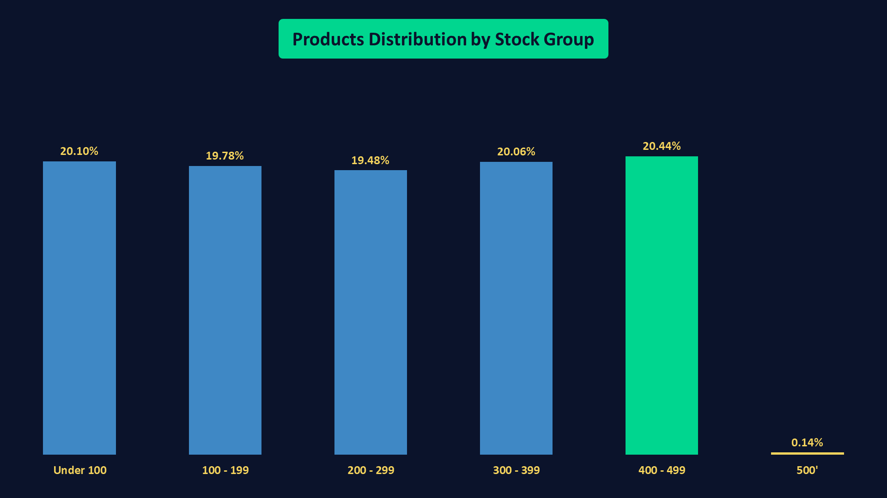
#### **Key Findings**
- Product inventory is distributed fairly evenly across the main stock groups, with each group accounting for approximately **19–20%** of the product catalog.
- The **400–499** stock group contains the largest share of products (**20.44%**), followed closely by the **Under 100** (**20.10%**) and **300–399** (**20.06%**) groups.
- No single stock group dominates the inventory distribution, indicating a balanced allocation of stock levels across products.
- Only **7 products (0.14%)** have the maximum stock level of **500 units**, making them a very small segment of the catalog.
#### **Business Interpretation**
Inventory levels are well balanced across the product catalog, with products spread almost uniformly across the defined stock ranges. This balanced distribution suggests that inventory is not heavily concentrated in either low-stock or high-stock products.

Only a handful of products have reached the maximum inventory level (**500 units**), indicating that very few products are stocked at the upper inventory limit. Whether these highly stocked products correspond to best-selling items or slow-moving inventory requires further business analysis.
### **Cart Adoption Analysis**
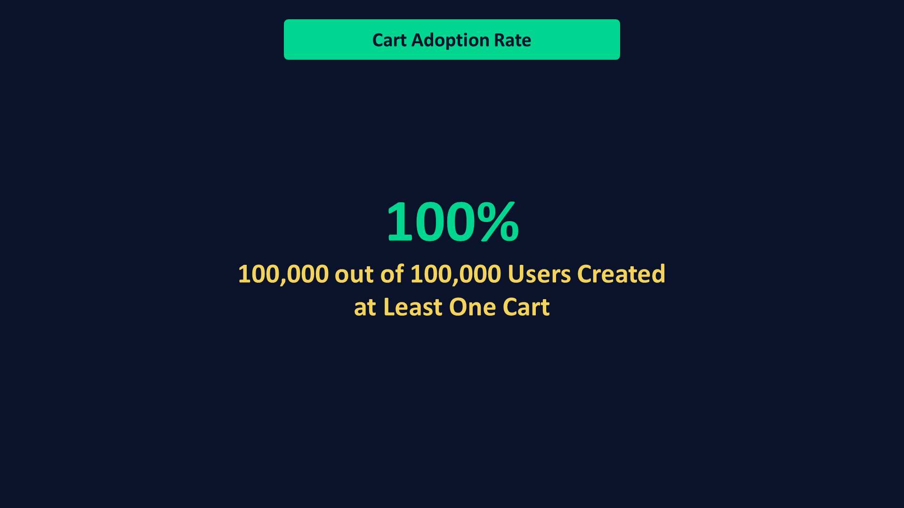
#### **Key Findings**
- All **100,000 registered users (100%)** created at least one shopping cart during the observed period.
- There are **361,028** carts generated by **100,000 unique users**, indicating that many users created multiple carts over time.
- No registered users were found without cart activity, confirming complete user participation in the dataset.
#### **Business Interpretation**
The dataset provides **full coverage of the registered user base**, as every user created at least one cart during the observation period. This ensures that cart abandonment analysis represents the entire customer population rather than a subset of active users.

The difference between the total number of carts (**361,028**) and unique users (**100,000**) also indicates repeated cart creation behavior, suggesting that many customers interacted with the shopping process multiple times. This makes the dataset suitable for analyzing abandonment patterns across multiple shopping sessions instead of only first-time cart creation.
### **Repeat Cart Creation Behavior**
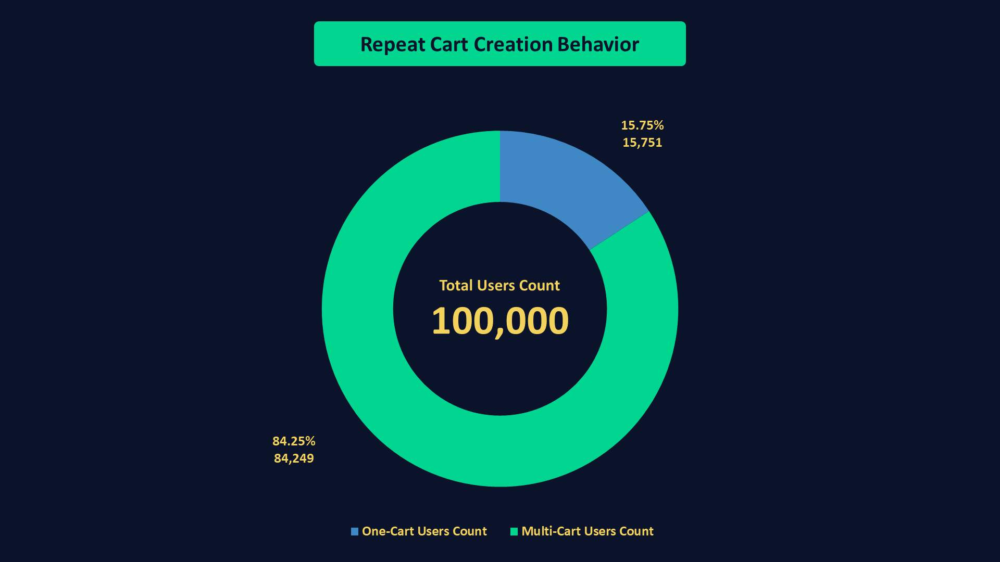
#### **Key Findings**
- Out of **100,000** users, **15,751** users (**15.75%**) created only one cart during the observation period.
- The remaining **84,249** users (**84.25%**) created two or more carts, indicating that multiple cart creation is the dominant behavior in the dataset.
- This suggests that repeated shopping-cart activity is common among users rather than being limited to a single shopping session.
#### **Business Interpretation**
A large majority of users created multiple carts during the analysis period, while only a small proportion interacted with the shopping cart once. This indicates that users frequently returned to create additional shopping sessions, providing sufficient repeated behavior for further analysis.

However, c**reating multiple carts should not be interpreted as customer retention or repeat purchasing on its own**. A user may create several carts without completing any purchase. Confirming customer retention or repeat purchase behavior requires analyzing completed orders and purchase history, which will be addressed in later stages of the project.
### **Cart Status Distribution**
#### **Key Findings**
- All **361,028** carts (**100%**) have the same status: **Active**.
- No variation exists in the `status` column, making it unsuitable for segmentation or comparative analysis.
#### **Business Interpretation**
The `status` field does not provide meaningful analytical value in the current dataset because every cart shares the same value (**Active**). This suggests that the column functions as a default or system-generated status rather than representing the actual lifecycle of a shopping cart.

As a result, the `status` column will not be used in subsequent analyses. Instead, cart outcomes (e.g., **completed purchase** vs. **abandoned cart**) will be determined using related transactional tables such as **orders** and **checkout_attempts**, which provide the actual business events required for cart abandonment analysis.
### **Cart Creation Trend**
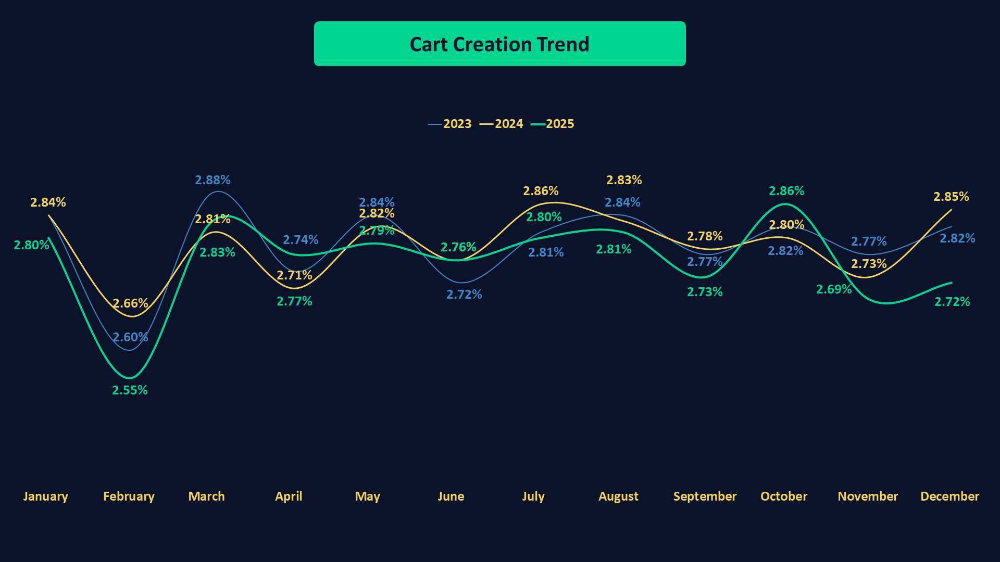
#### **Key Findings**
- Cart creation activity remained highly stable throughout the three-year period, with monthly contributions ranging from **2.55%** to **2.88%** of total carts.
- The average monthly share was **2.78%**, while the median was **2.80%**, indicating a balanced distribution with minimal month-to-month variation.
- Trend analysis showed a slight overall **downward** trend across the full three-year period (**Slope = -0.004**). However, when each year was analyzed separately, **2023**, **2024**, and **2025** each exhibited a slight upward trend with slope values of **0.003**, **0.004**, and **0.001**, respectively.
- Despite the difference in trend direction, all slope values are very close to zero, indicating that changes over time are minimal and overall cart creation volume remains stable.
#### **Business Interpretation**
The dataset demonstrates a consistent flow of cart creation throughout the observation period without significant fluctuations, seasonal spikes, or abrupt declines. This stability suggests that the synthetic dataset was generated with a relatively uniform distribution of cart activity over time.

Although the overall trendline is marginally negative while each individual year shows a slight positive trend, the magnitude of all slope values is extremely small. Therefore, these trends should be interpreted as **minor directional changes rather than meaningful business growth or decline**.
### **Carts Distribution per User**
| Metric         | Value      |
| -------------- | -----------|
| Minimum        | 1          |
| Average        | 3.61       |
| Median         | 4          |
| Maximum        | 12         |
#### **Key Findings**
- Users created between **1** and **12** carts during the observation period.
- The average number of carts per user is **3.61**, while the median is **4** carts.
- The small difference between the mean and median suggests that the distribution is relatively balanced, with a slight tendency toward a **left-skewed** distribution.
- Half of all users created **4 carts or fewer**, while the other half created **4 carts or more**.
#### **Business Interpretation**
Most users created multiple carts over the analysis period, with a typical user generating around **4 shopping carts**. The close proximity of the mean and median indicates that cart creation behavior is fairly consistent across users, without extreme concentration among a small group of highly active users.

While the distribution shows a slight left skew, the difference between the mean and median is minimal, suggesting that user cart creation is generally well distributed rather than heavily influenced by outliers.
### **ََProducts Quantity Distribution Analysis**
| Metric         | Value      |
| -------------- | -----------|
| Count          | 1,083,844  |
| Average        | 2          |
| Median         | 2          |
| Minimum        | 1          |
| Q1             | 1          |
| Q3             | 3          |
| IQR            | 2          |
| Maximum        | 3          |
| Standard Deviation | 0.82   |
| Upper Bound    | 6          |
| Lower Bound    | -2         |
#### **Key Findings**
- Product quantities per cart item range from **1** to **3** units.
- The average and median quantity are both **approximately 2** units, indicating a highly balanced distribution.
- The interquartile range (**IQR = 2**) and outlier analysis identified **no positive or negative outliers**, as all quantities fall within the expected bounds (**-2 to 6**).
- The standard deviation (**0.82**) indicates **low** variability in product quantities across cart items.
#### **Business Interpretation**
The quantity distribution is highly consistent, with most cart items containing only a small number of units. This suggests that customers typically add products in modest quantities rather than purchasing large quantities of the same item within a single cart.

The absence of outliers and the low standard deviation indicate a stable quantity distribution, making this variable unlikely to introduce bias in subsequent cart abandonment analyses.
### **ََProducts Quantity Distribution by Quantity**
#### **Key Findings**
- Product quantity is limited to **three possible values (1, 2, and 3 units)**.
- The three quantity levels are almost equally distributed, each representing approximately one-third of all cart items.
- Due to this limited and balanced distribution, additional quantity bucketing would not provide meaningful analytical value.
### **ََCart Size Analysis**
| Metric         | Value      |
| -------------- | -----------|
| Minimum        | 1          |
| Q1             | 2          |
| Median         | 3          |
| Average        | 3.00       |
| Q3             | 4          |
| Maximum        | 5          |
| Standard Deviation | 1.41   |
#### **Key Findings**
- The typical shopping cart contains **3 products**.
- Half of all carts contain between **2 and 4 products**.
- Cart sizes range from **1 to 5 products**, indicating a relatively narrow distribution.
- The close agreement between the mean and median, together with the low standard deviation, suggests a stable and well-balanced cart size distribution.
#### **Business Interpretation**
Customers generally create shopping carts containing a small number of products, with most carts holding **2 to 4** items. The stable distribution of cart sizes makes this variable suitable for further analysis, where its relationship with cart abandonment and checkout completion will be examined.
### **ََProduct Coverage Analysis**
#### **Key Findings**
- All **5,000 products (100%)** appear at least once in customer shopping carts, indicating complete product coverage across the analysis period.
#### **Business Interpretation**
Since every product has been added to at least one cart, no catalog items are excluded from downstream cart abandonment analyses, allowing subsequent product-level insights to be generated from the complete product catalog.
### **Payment Method Distribution**
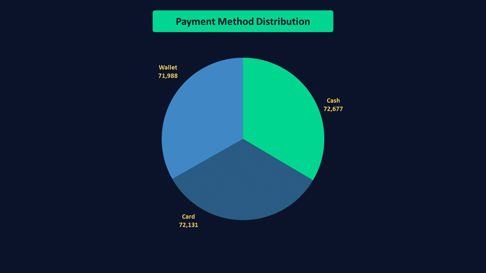
#### **Key Findings**
- Checkout attempts are almost equally distributed across the three available payment methods.
- **Cash** is the most frequently used payment method, accounting for **33.52%** of all checkout attempts, followed by **Card** (**33.27%**) and **Wallet** (**33.21%**).
- The difference between the highest and lowest proportions is only **0.31%**, indicating a highly balanced distribution with no dominant payment method.
#### **Business Interpretation**
The balanced distribution of payment methods suggests that customers do not exhibit a strong preference for a single payment option at the checkout stage. This provides a representative foundation for subsequent analyses comparing checkout completion and cart abandonment behavior across different payment methods.
### **Completion Status Distribution**
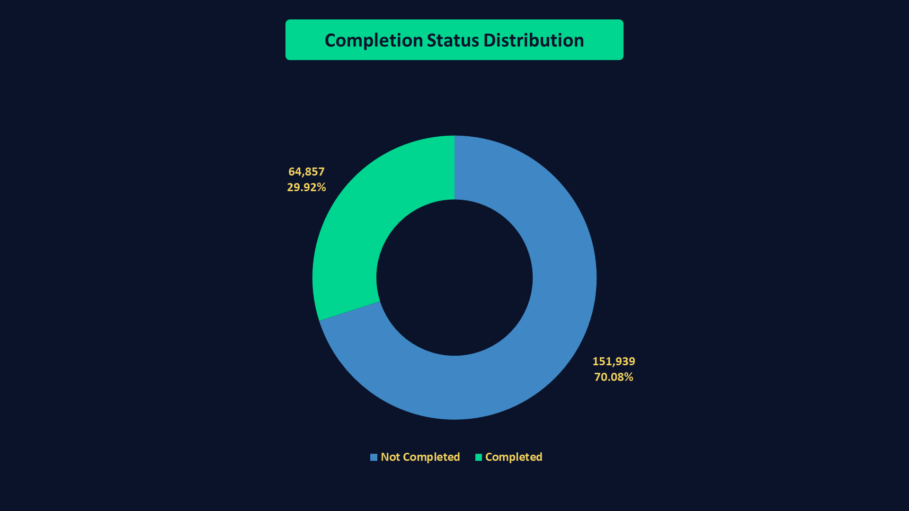
#### **Key Findings**
- **Completed** checkouts account for **64,857** attempts (**29.92%**), while **151,939** attempts (**70.08%**) were **Not Completed**.
- Uncompleted checkout attempts occur approximately **2.3** times more frequently than completed checkouts.
- The distribution indicates that most checkout attempts do not progress to successful completion.
#### **Business Interpretation**
The high proportion of uncompleted checkout attempts highlights the checkout stage as a critical point in the customer journey that warrants further investigation.

Checkout completion status will serve as a key variable in subsequent cart abandonment analyses to identify factors associated with successful purchases and incomplete transactions.

Given that the number of completed checkout attempts matches the total number of orders in the dataset, there appears to be a one-to-one relationship between completed checkouts and successfully placed orders, which will be further validated during downstream analyses.
### **Shipping Cost Distribution Analysis**
| Metric         | Value      |
| -------------- | -----------|
| Minimum        | 2          |
| Q1             | 7.78       |
| Median         | 13.55      |
| Average        | 13.53      |
| Q3             | 19.28      |
| Maximum        | 25         |
| Standard Deviation | 6.64   |
| IQR            | 11.5       |
| Upper Bound    | 36.53      |
| Lower Bound    | -9.47      |
#### **Key Findings**
- Shipping costs range from **2.00** to **25.00** across all checkout attempts.
- The average shipping cost (**13.53**) is nearly identical to the median (**13.55**), suggesting a highly balanced distribution with no noticeable skewness.
- Half of all shipping costs fall between **7.78** and **19.28**, indicating that most checkout attempts incur moderate shipping fees.
- No **positive** or **negative** outliers were identified based on the IQR method, suggesting that shipping costs are consistently distributed across the dataset.
- The standard deviation of **6.64** indicates moderate variation in shipping costs without extreme values.
#### **Business Interpretation**
The absence of outliers and the balanced distribution of shipping costs suggest that shipping fees are applied consistently across checkout attempts.

Since most shipping costs are concentrated within a relatively narrow range, shipping fees are unlikely to be driven by a small number of unusually high-cost transactions.

Shipping cost will be examined in subsequent analyses to determine whether different shipping fee levels are associated with variations in checkout completion and cart abandonment behavior.
### **Shipping Cost by Shipping Cost Group**
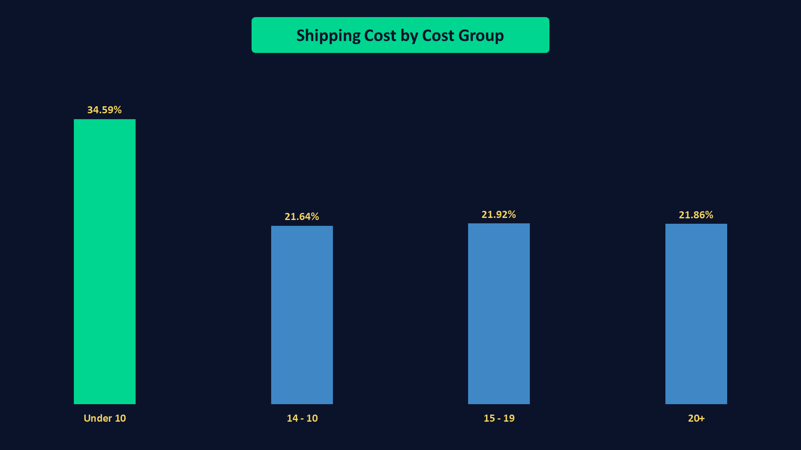
#### **Key Findings**
- Shipping costs are relatively well distributed across all checkout attempts, with no single cost group overwhelmingly dominating the dataset.
- The largest segment is `Under 10`, accounting for **74,982** checkout attempts (**34.59%**).
- The remaining checkout attempts are distributed almost equally across the other three groups: **10 - 14 (21.64%)**, **15 - 19 (21.92%)**, and **20+ (21.86%)**.
- Approximately **two-thirds** of checkout attempts (**65.41%**) incur shipping costs of **10 or higher**, indicating that moderate shipping fees are common throughout the dataset.
#### **Business Interpretation**
The relatively balanced distribution of shipping cost groups provides a suitable foundation for evaluating whether shipping fees influence checkout completion and cart abandonment behavior.

Since shipping costs are not heavily concentrated within a single price range, subsequent analyses can more reliably compare customer behavior across different shipping fee levels.

Shipping cost groups will be leveraged in downstream analyses to determine whether higher shipping fees are associated with lower checkout completion rates or increased cart abandonment.
### **Checkout Attempt Trend Analysis**
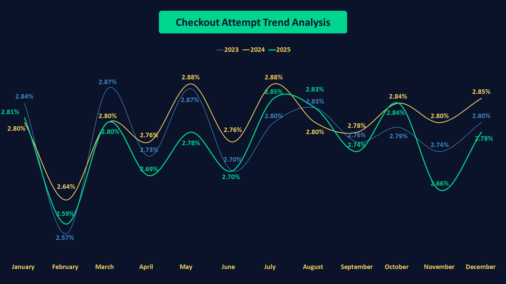
#### **Key Findings**
- Checkout attempts are consistently distributed across the 36-month period, with monthly contributions ranging from **2.57%** to **2.88%** of all checkout attempts.
- The average monthly contribution is approximately **2.78%**, indicating a highly stable temporal distribution with only minor month-to-month fluctuations.
- No significant spikes or sudden declines were observed throughout the dataset period.
- The overall trend remains relatively stable over time, with only negligible variations that do not suggest a meaningful upward or downward movement in checkout activity.
- The highest monthly contribution was recorded in **July 2024** (**2.88%**), while the lowest occurred in **February 2023** (**2.57%**). However, the difference between them is relatively small (**0.31 percentage points**).
#### **Business Interpretation**
The stability of checkout attempts over time suggests that the dataset was generated with a consistent level of customer checkout activity across the three-year period.

The absence of substantial temporal fluctuations reduces the likelihood that subsequent analyses will be disproportionately influenced by a particular month or time period.

Since checkout attempts exhibit a balanced time distribution, downstream analyses of checkout completion and cart abandonment can be conducted without introducing significant temporal bias.
### **Total Amount Distribution Analysis**
| Metric         | Value      |
| -------------- | -----------|
| Count          | 64,857     |
| Minimum        | 20.04      |
| Q1             | 512.35     |
| Median         | 1008.9     |
| Average        | 1008.69    |
| Q3             | 1505.2     |
| Maximum        | 1999.98    |
| Standard Deviation | 572.81 |
| IQR            | 992.85     |
| Upper Bound    | 2994.47    |
| Lower Bound    | -976.93    |
#### **Key Findings**
- Order values range from **20.04** to **1,999.98** across all completed purchases.
- The average order value (**1,008.69**) is nearly identical to the median (**1,008.90**), indicating a well-balanced and relatively symmetric distribution of order values.
- Half of all orders fall between **512.35** and **1,505.20**, suggesting moderate variability in purchase amounts across customers.
- No positive or negative outliers were identified using the IQR method, indicating the absence of unusually large or exceptionally small order values within the dataset.
- The quartile distribution demonstrates that order values are relatively evenly spread around the median, further supporting the stability of the distribution.
#### **Business Interpretation**
The balanced distribution of order values suggests that revenue generation is not disproportionately driven by a small number of exceptionally large purchases. Instead, customer spending appears to be distributed across a broad range of order values.

The absence of extreme outliers indicates that purchasing behavior remains relatively consistent throughout the dataset, reducing the risk of aggregate metrics being heavily influenced by a small subset of transactions.

Since order values are spread across low, medium, and high purchase amounts, subsequent analyses can segment orders by value to investigate potential relationships with payment methods, checkout completion patterns, and cart abandonment behavior.
### **Revenue Contribution Analysis**
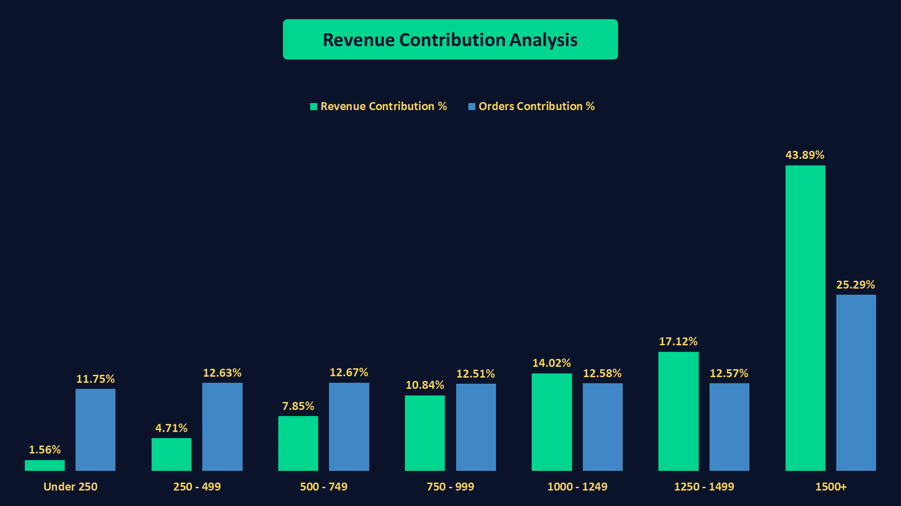
#### **Key Findings**
- Orders valued at **1,500+** represent the largest segment, accounting for **25.29%** of all orders while contributing **43.89%** of total revenue.
- Lower-value orders (**under 250**) account for **11.75%** of total orders but contribute only **1.56%** of total revenue.
- Order volumes are relatively balanced across the mid-value segments (**250–1,499**), with each group contributing approximately **12%** of total orders.
- Revenue contribution increases progressively as order values increase, indicating that higher-value orders have a disproportionate impact on overall revenue.
- Nearly half of the total revenue is generated by approximately one-quarter of all orders, highlighting the significant contribution of high-value purchases.
#### **Business Interpretation**
High-value orders are the primary drivers of revenue generation. Although they represent only one-quarter of all orders, they contribute nearly half of the total revenue, making them strategically important for the business.

Lower-value orders contribute meaningfully to order volume but have a relatively limited impact on revenue. Improving their average order value through cross-selling or upselling strategies could increase their revenue contribution.

The balanced distribution of order counts across the mid-value segments suggests stable purchasing behavior across a broad range of transaction values.

From a business perspective, maintaining customer acquisition across all order segments while preserving and growing the high-value segment could have the greatest impact on revenue performance.
### **Events Distribution Analysis**
#### **Key Findings**
- Event frequencies are highly balanced across all event types, ranging from **14.26%** to **14.33%** of total recorded events.
- No single event type dominates user interactions, indicating a uniformly distributed synthetic event generation process.
- The number of event occurrences consistently exceeds the number of distinct carts for each event type, suggesting that a single cart may generate the same event multiple times.
- The `cart_events` table captures event-level interactions rather than unique cart-level transitions.
#### **Business Interpretation**
The balanced distribution of event types indicates that the dataset was designed to represent a broad range of cart-related behaviors without overrepresenting any particular interaction.

Since carts can generate multiple occurrences of the same event, analyses involving user journeys or conversion paths should account for repeated interactions rather than assuming a one-to-one relationship between carts and events.

Consequently, event counts should be interpreted as measures of user interaction frequency rather than the number of unique carts progressing through each stage of the shopping journey.
### **Event Frequency per Cart**
| Metric         | Value      |
| -------------- | -----------|
| Minimum        | 3          |
| Q1             | 6          |
| Median         | 9          |
| Average        | 9.01       |
| Q3             | 12         |
| Maximum        | 15         |
| Standard Deviation | 3.74   |
| IQR            | 6          |
| Upper Bound    | 21         |
| Lower Bound    | -3         |
#### **Key Findings**
- The typical cart generates 9 events, with the **mean (9.01)** and **median (9)** being nearly identical, indicating an exceptionally balanced distribution.
- Half of all carts generate between **6** and **12** events (between Q1 and Q3).
- Event frequencies range from **3** to **15** events per cart, suggesting moderate variation in cart-level interactions.
- No positive or negative outliers were identified using the IQR method, as all observed values fall within the calculated bounds.
- The relatively low standard deviation (**3.74**), together with the close agreement between the mean and median, indicates highly consistent event generation patterns across carts.
#### **Business Interpretation**
Most carts exhibit similar levels of interaction throughout the shopping journey, with no small subset of carts disproportionately contributing to overall event activity.

The balanced distribution suggests that cart-level behaviors are well represented across the dataset, making aggregate event metrics reliable for subsequent analyses.

Since carts typically generate multiple events rather than a single interaction, user behavior should be interpreted as a sequence of actions occurring throughout the shopping process rather than isolated events.

The absence of extreme values indicates that the dataset captures consistent shopping behaviors without being heavily influenced by unusually active or inactive carts.
### **Events Trend Analysis**
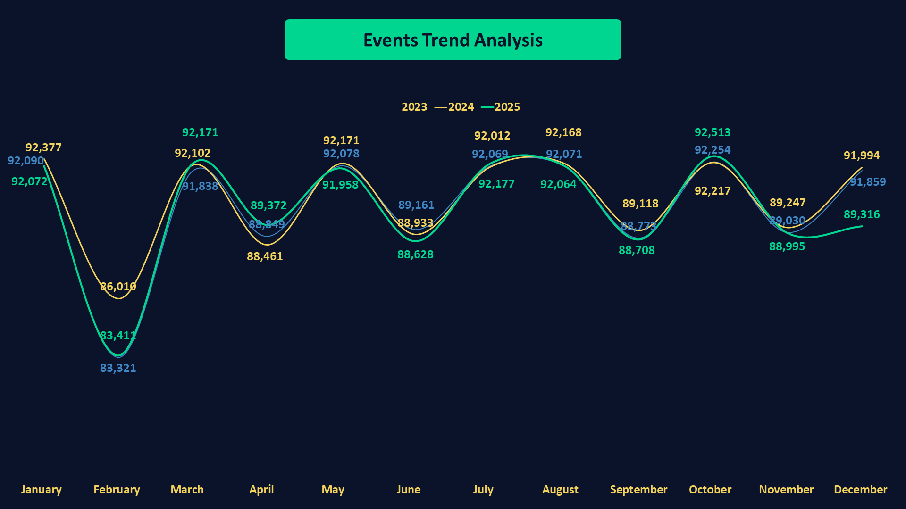
#### **Key Findings**
- Monthly event volumes remain highly stable throughout the three-year period, typically ranging between approximately **88 thousand and 93 thousand** events.
- A recurring seasonal pattern is observed in **February** across all three years, where event volumes experience a noticeable decline followed by a recovery in **March**.
- Trend analysis indicates a **negligible positive trend** over time, with extremely small slope values and weak correlations across both the overall period and individual years.
- Event activity exhibits limited **month-to-month** variability, suggesting a consistent synthetic event generation process throughout the dataset.
#### **Business Interpretation**
The stability of monthly event volumes indicates that user interactions are consistently represented throughout the observation period without significant fluctuations.

The recurring February decline followed by March recovery suggests the presence of a seasonal component in the synthetic data generation process.

Given the weak correlations observed in the trend analysis, changes in event volumes over time are better characterized as seasonal fluctuations rather than meaningful long-term growth or decline.

The consistent distribution of event activity across months provides a reliable foundation for downstream cart abandonment analyses without requiring adjustments for major temporal imbalances.
### **Carts Distribution by Abandonment Reason**
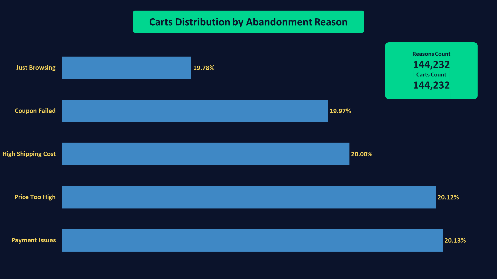
#### **Key Findings**
- The `abandonment_reasons` table contains **144,232** records representing **144,232** distinct carts, indicating that each abandoned cart is associated with exactly **one** abandonment reason.
- Five abandonment reasons are represented in the dataset: `Payment Issues`, `Price Too High`, `High Shipping Cost`, `Coupon Failed`, and `Just Browsing`.
- The distribution of abandonment reasons is highly balanced, with each reason accounting for approximately **20%** of all abandoned carts.
- No single abandonment reason dominates the dataset, suggesting that cart abandonment behavior is evenly distributed across the available categories.
#### **Business Interpretation**
The balanced distribution indicates that the synthetic dataset was intentionally designed to represent multiple cart abandonment scenarios without disproportionately emphasizing any particular reason.

Since no abandonment reason significantly outweighs the others, downstream analyses should consider all reasons as equally important contributors to cart abandonment behavior.

The one-to-one relationship between carts and abandonment reasons simplifies cart-level analyses by ensuring that each abandoned cart can be attributed to a single primary cause.
### **Confidence Score Distribution Analysis**
| Metric         | Value      |
| -------------- | -----------|
| Minimum        | 0.5        |
| Q1             | 0.61       |
| Median         | 0.72       |
| Average        | 0.72       |
| Q3             | 0.84       |
| Maximum        | 0.95       |
| Standard Deviation | 0.13   |
| IQR            | 0.23       |
| Upper Bound    | 1.185      |
| Lower Bound    | 0.265      |
#### **Key Findings**
- Confidence scores range from **0.50** to **0.95**, indicating moderate to high confidence levels across all abandonment reasons.
- The **mean (0.72)** and **median (0.72)** are identical, suggesting a highly balanced distribution with no meaningful skewness.
- **50%** of all confidence scores fall between **0.61** and **0.84**.
- No positive or negative outliers were identified based on the IQR method.
- The relatively small standard deviation (**0.13**) indicates limited variability in confidence levels across the dataset.
#### **Business Interpretation**
Abandonment reasons are consistently assigned with moderate to high confidence levels, supporting their reliability for downstream cart abandonment analyses.

The balanced distribution of confidence scores suggests that no small subset of records disproportionately influences aggregate confidence metrics.

Since confidence values exhibit limited variability and contain no extreme observations, they provide a stable measure for evaluating abandonment patterns across different cart segments.

## **Analysis Unit**
**The unit of analysis for this project is the shopping cart (`cart_id`). Each cart represents a customer's purchasing intent and serves as the central entity linking user interactions, cart contents, checkout behavior, completed orders, and abandonment outcomes.**

**All analyses were performed at the cart level to ensure metric consistency across the different stages of the cart lifecycle. Tables such as `cart_items`, `cart_events`, `checkout_attempts`, `orders`, and `abandonment_reasons` were aggregated or joined using `cart_id`, allowing each cart to be tracked from creation through either successful purchase or abandonment.**

**Consequently, business metrics including cart abandonment rates, checkout completion rates, order conversions, and abandonment patterns are defined and interpreted at the cart level throughout the project.**

## **Key Business Questions**
- **1. What is the overall CAR ?**
- **2. Which customer segments exhibit the highest abandonment rates ?**
- **3. Does cart value influence abandonment behavior ?**
- **4. Does cart size influence abandonment behavior ?**
- **5. Does shipping cost affect abandonment rates ?**
- **6. Which payment methods are associated with higher checkout completion rates ?**
- **7. Which abandonment reasons are most common ?**
- **8. Are specific abandonment reasons associated with particular cart characteristics ?**
- **9. What factors are associated with high-value abandoned carts ?**
- **10. Which business dimensions provide the greatest opportunities for reducing cart abandonment ?**

## **Analysis**
### **1. What is the overall CAR ?**
| Metric                      | Value      |
| --------------------------- | -----------|
| Eligible Carts Count        | 361,028    |
| Completed Carts Count       | 64,857     |
| Abandoned Carts Count       | 296,171    |
| **Cart Completion Rate (CCR)**  | **17,96%**     |
| **Cart Abandonment Rate (CAR)** | **82,04%**     |
#### **Key Insights**
- All **361,028** carts satisfy the business definition of an **Eligible Cart** (i.e., `contain at least one item`), indicating that the dataset contains no empty carts.
- The Cart Completion Rate (**CCR**) is **17.96%**, while the Cart Abandonment Rate (**CAR**) reaches **82.04%**.
- More than four out of every five eligible carts do not result in a completed purchase.
#### **Business Interpretation**
The high Cart Abandonment Rate highlights a substantial gap between purchase intent and completed transactions. Although customers actively add products to their carts, only a relatively small proportion proceed to complete their orders.

At this stage, the analysis confirms the existence of significant purchase drop-off behavior but does not explain its causes. The subsequent analyses will investigate whether factors such as customer characteristics, cart value, cart size, shipping costs, payment methods, and abandonment reasons are associated with higher abandonment rates.

Consequently, reducing cart abandonment represents the primary business opportunity identified in this dataset, as even modest improvements in cart completion could translate into meaningful increases in completed orders and revenue.

**2. Which customer segments exhibit the highest abandonment rates ?**
#### **2.1 - CAR by Customer Type**
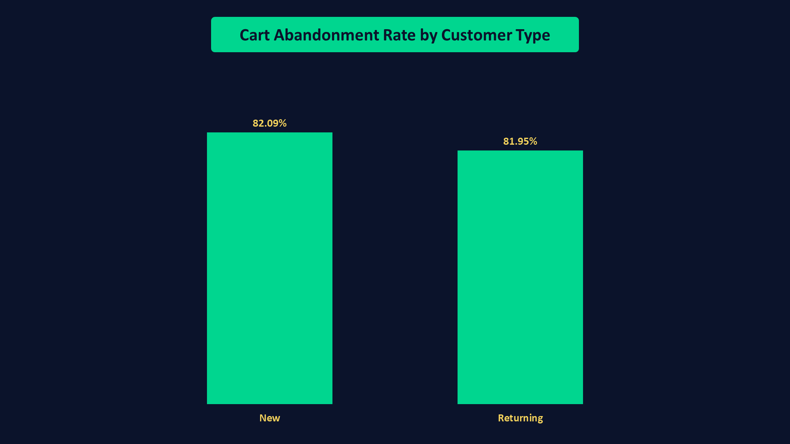
#### **Key Insights**
- **New** and **returning** customers exhibit nearly identical Cart Abandonment Rates (**~82%**), indicating no meaningful difference in abandonment behavior between the two customer segments.
#### **Business Interpretation**
**Customer type** does not appear to be a significant driver of cart abandonment in this dataset, suggesting that improvement efforts should be directed toward other business dimensions.
#### **2.2 - CAR by Acquisition Channel**
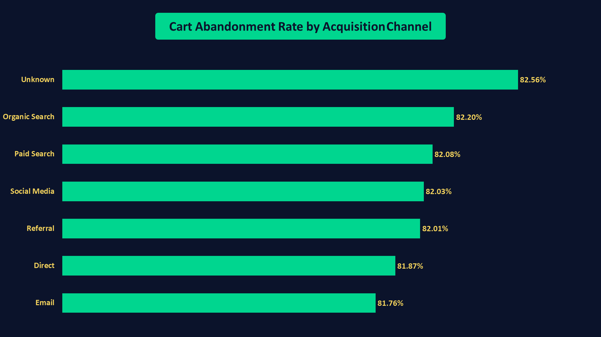
#### **Key Insights**
- **Cart Abandonment Rates** are remarkably consistent across all acquisition channels (ranging from **81.76%** to **82.56%**), indicating minimal variation in abandonment behavior among customer acquisition segments.
#### **Business Interpretation**
**Acquisition channels** do not appear to be a significant driver of cart abandonment in this dataset, suggesting that optimization efforts should focus on other business dimensions that may have a greater impact on checkout completion.
#### **2.3 - CAR by Premium Status**
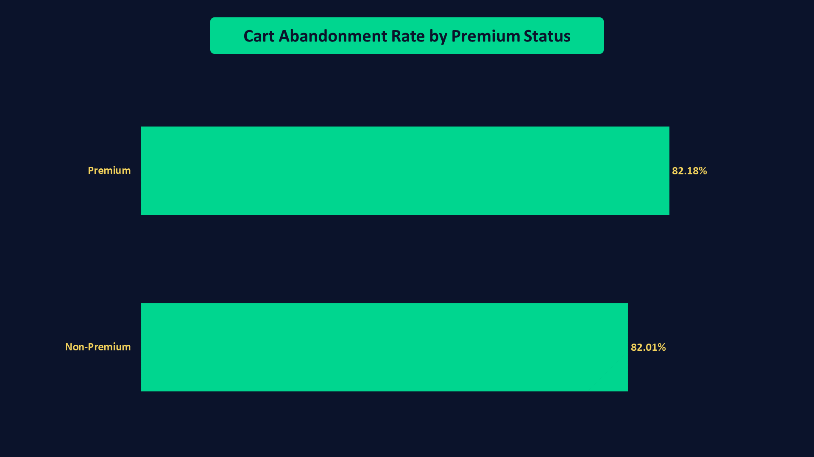
#### **Key Insights**
- **Premium** and **Non-Premium** customers exhibit nearly identical Cart Abandonment Rates (**~82%**), indicating no meaningful difference in abandonment behavior between the two customer groups.
#### **Business Interpretation**
**Premium status** does not appear to significantly influence cart abandonment in this dataset, suggesting that factors beyond customer membership status are more likely to explain the high abandonment rate.
#### **2.4 - CAR by Age Group**
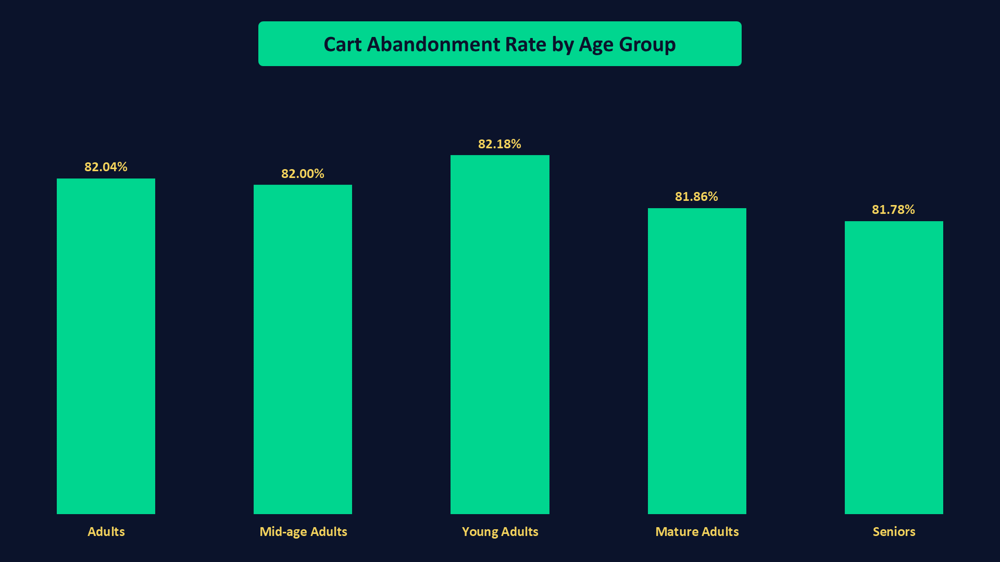
#### **Key Insights**
- Cart Abandonment Rates remain consistently close across all age groups (**81.78%–82.18%**), indicating that customer age has minimal influence on abandonment behavior.
#### **Business Interpretation**
Age group does not appear to be a meaningful driver of cart abandonment in this dataset, suggesting that the high abandonment rate is likely influenced by factors other than customer demographics.
#### **2.5 - CAR by Country**
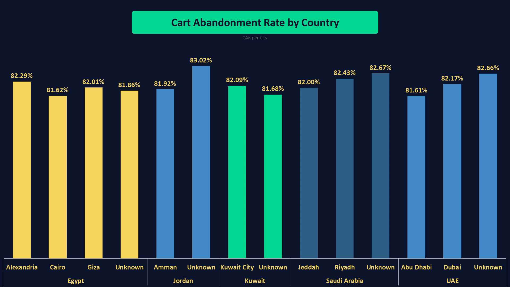
#### **Key Insights**
- Cart Abandonment Rates remain consistently close across countries and cities, with only minor variations around the overall average, indicating no meaningful geographic differences in abandonment behavior.
#### **Business Interpretation**
Geographic location does not appear to be a significant driver of cart abandonment in this dataset, suggesting that optimization efforts should prioritize operational or checkout-related factors rather than regional differences.

