# E-commerce Cart Abandonment Analysis

## **Project Overview**
Cart abandonment is one of the most important challenges in e-commerce, directly impacting revenue and customer conversion. Every abandoned shopping cart represents potential sales that were not completed.

This project analyzes customer behavior throughout the shopping cart journey to understand where users drop off, identify patterns behind cart abandonment, and estimate the potential business impact.

Using SQL, the project explores user activity, cart behavior, checkout attempts, orders, and cart events to measure abandonment, discover behavioral trends, and provide actionable business recommendations for improving conversion rates.

## **Business Problem**
An e-commerce company has noticed that a considerable number of customers add products to their shopping carts but leave the website before completing their purchases.

This behavior results in lost sales opportunities, lower conversion rates, and reduced return on marketing investments. While customers successfully reach the shopping cart stage, the company lacks clear visibility into why many purchase journeys end before checkout completion.

To improve conversion performance, the business needs to understand customer behavior during the shopping journey, identify abandonment patterns, and uncover opportunities to recover lost revenue.

## **Project Goal**
The goal of this project is to measure cart abandonment performance, identify the key drivers behind customer drop-off, quantify the business impact, and provide data-driven recommendations that help increase completed purchases and recover lost revenue.

## **Executive Summary**
**NO SUMMARY YET**

## **Dataset Description**
| Table       | Description                             |
| ----------- | --------------------------------------- |
| Users       | Contains customer profile information, including demographics, acquisition channels, device preferences, and membership status. This table represents the customer dimension used throughout the analysis.                                                 |
| Products    | Stores product information such as category, brand, pricing, cost, inventory status, and customer ratings. It provides the product context for items added to shopping carts.                                            |
| Carts      | Represents shopping carts created by customers. Each cart belongs to a single user and records when the cart was created, serving as the central entity for abandonment analysis.                                              |
| Cart Items    | Contains the individual products added to each shopping cart, including quantities and item prices. This table links carts with products and enables product-level abandonment analysis.                                   |
| Checkout Attempts    | Records customers who initiated the checkout process, including payment method, shipping cost, and whether the checkout was successfully completed.                                   |
| Orders    | Contains completed purchases generated from successful checkout attempts. This table represents converted shopping carts and is used to distinguish completed purchases from abandoned carts.                                  |
| Cart Events    | Stores user interactions related to shopping cart activities, such as cart creation, item additions or removals, checkout initiation, payment failures, purchase completion, and cart abandonment. These events help analyze customer behavior throughout the purchase journey.                                   |
| Abandonment Reasons    | Contains the simulated reason associated with each abandoned cart, along with a confidence score indicating the likelihood of that reason. This table supports root cause analysis of cart abandonment.                                  |

## **Schema Design**
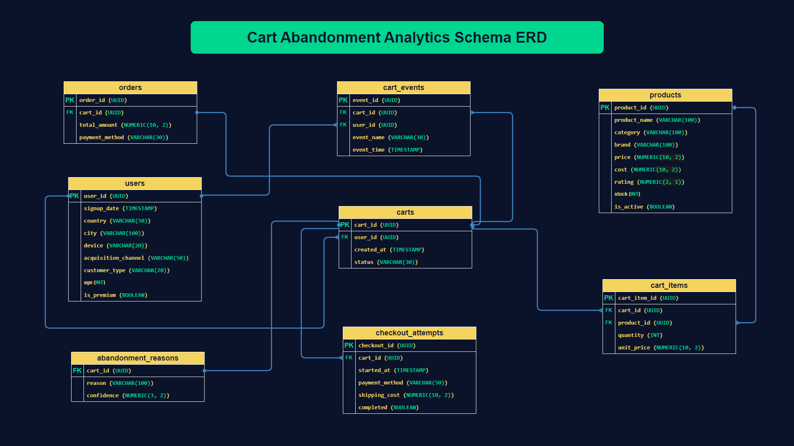

## **Data Preparation**
### **Data Quality Assessment**
A comprehensive data quality assessment was performed before moving data from the **raw_data** layer to the **analytics_data** layer. The objective was to evaluate data quality, validate table relationships, and identify any potential issues that could impact downstream analysis.

The assessment focused on ensuring the dataset was complete, consistent, and reliable for cart abandonment analysis.

The following checks were performed:
- Checked for exact duplicate records across all tables.
- Validated primary key uniqueness.
- Assessed missing values and data completeness.
- Identified orphan records.
- Validated categorical values against their expected domains.
- Verified numeric value ranges and business rule consistency.

### **Issues Found**
| Check          | Result                                    |
| -------------- | ----------------------------------------- |
| Missing Values | **city** column: 5,125 records (5.12%)    |
| Business Rule | **11 active products** have zero stock (`stock = 0` while `is_active = TRUE`). |

### **Data Cleaning Process**
Following the data quality assessment, only minimal cleaning was required before loading the data into the analytical layer.

The following transformations were applied:
- Replaced missing values in the `city` column with **'Unknown'** using `COALESCE()` to preserve records while avoiding bias toward any existing city.
- Retained the **11 active products with zero stock** without modification. Due to their low frequency relative to the dataset size, they were treated as valid business anomalies rather than data errors and were preserved for analysis.

No duplicate records, orphan records, or primary key violations were found. Therefore, no additional cleaning or record removal was required.

## **Exploratory Data Analysis (EDA)**
- The **users** table contains **100,000** users, the **products** table contains **5,000** products, the **orders** table contains **64,857** orders, the **checkout_attempts** table conatins **216,796** attempts, the **carts** table conatins **361,028** carts, the **cart_items** table contains **1,083,844** cart items, the **cart_events** table conatins **3,251,588** events, the **abandonment_reasons** table conatins **144,232** records.

### **Users Volume by Country**
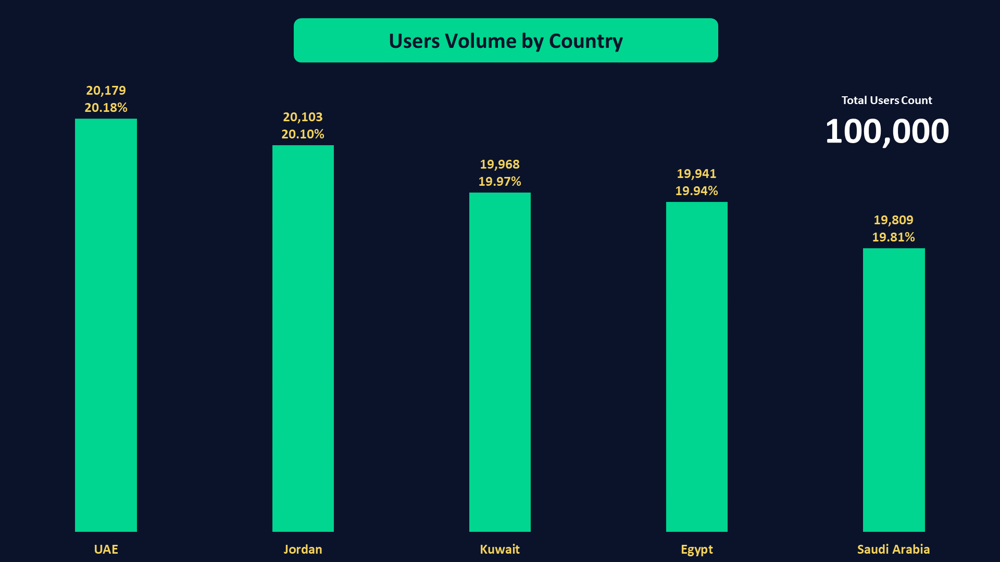
#### **Key Findings**
- The user base is distributed almost evenly across the **five** countries, with each market contributing approximately **20%** of the total users.
- The **UAE** has the largest user base, representing **20.18%** of all registered users.
- **Saudi Arabia** has the smallest user base, accounting for **19.81%** of total users.
- The difference between the largest and smallest country segments is minimal, indicating a well-balanced geographic distribution.
#### **Business Interpretation**
The dataset represents a balanced customer distribution across the five target markets, with no single country dominating the user base. This balanced distribution helps reduce geographic bias in subsequent analyses, making cross-country comparisons more reliable. Any significant differences observed later in cart abandonment behavior or conversion performance are therefore less likely to be driven solely by differences in user population size.
### **Users Volume by City**
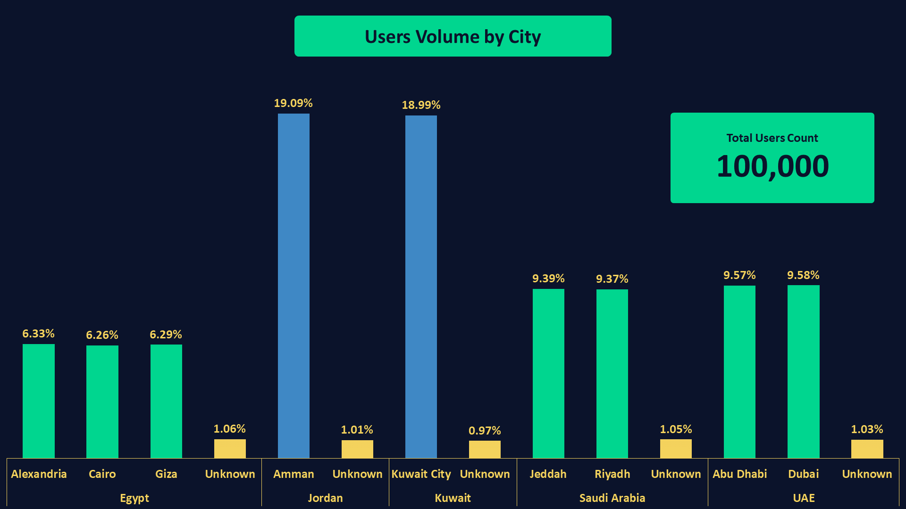
#### **Key Findings**
- User distribution across cities is balanced within each country, with no single city overwhelmingly dominating its local user base.
- **Amman** and **Kuwait City** have the largest individual city populations, representing **19.09%** and **18.99%** of the total user base, respectively. This is expected since each is the only represented city for its country.
- In **Egypt**, users are distributed almost evenly across **Alexandria (6.33%)**, **Giza (6.29%)**, and **Cairo (6.26%)**.
- In **Saudi Arabia**, the user base is nearly equally divided between **Jeddah (9.39%)** and **Riyadh (9.37%)**.
- In the **UAE**, **Dubai (9.58%)** and **Abu Dhabi (9.57%)** show an almost identical user distribution.
- The **Unknown** city category accounts for approximately **1%** of users in every country, reflecting a consistent pattern of missing city values across the dataset.
#### **Business Interpretation**
The city distribution indicates that the dataset was generated with a balanced geographic representation within each country. No individual city disproportionately dominates its country's customer base, reducing the likelihood of geographic concentration bias during subsequent analyses.

Additionally, the **Unknown** city values are consistently distributed across all countries rather than concentrated in a specific market. This suggests that the missing city information is a general data quality issue rather than a country-specific problem, making it less likely to distort geographic comparisons in later analyses.
### **Users Volume by Device**
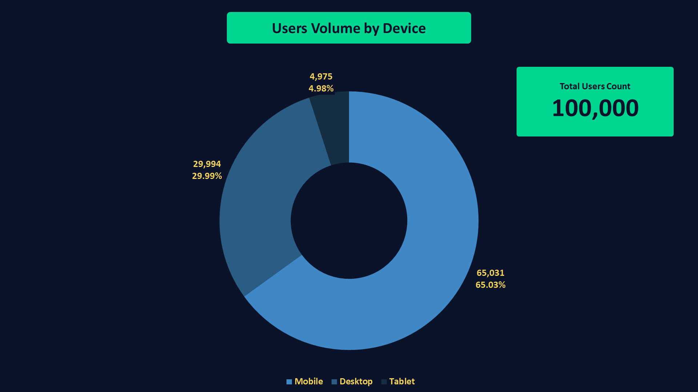
#### **Key Findings**
- **Mobile** is the most commonly used device, accounting for **65.03%** of the total user base.
- **Desktop** is the second most popular platform, representing **29.99%** of users.
- **Tablet** usage is relatively limited, contributing only **4.98%** of the total users.
- The device distribution is clearly **skewed** toward **mobile**, with nearly **two-thirds** of users accessing the platform through mobile devices.
#### **Business Interpretation**
The dataset indicates a strong preference for **mobile** devices, with mobile users representing the majority of the customer base. This distribution reflects a **mobile-first** usage pattern that is commonly observed in modern e-commerce platforms.

Given the significant share of mobile users, subsequent analyses should compare cart abandonment and conversion performance across device types to determine whether user behavior differs between mobile, desktop, and tablet users.
### **Users Volume by Acquisition Channel**
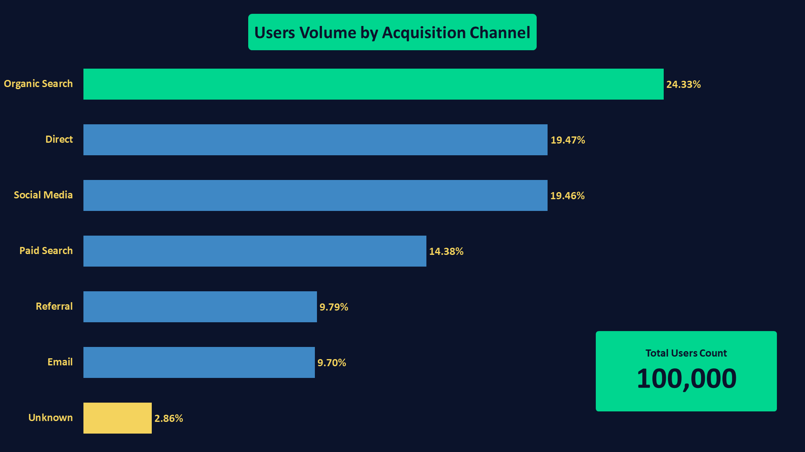
#### **Key Findings**
- **Organic Search** is the largest acquisition channel, accounting for **24.33%** of all users.
- **Direct (19.47%)** and **Social Media (19.46%)** contribute nearly identical shares, making them the second-largest sources of user acquisition.
- **Paid Search** represents **14.38%** of the user base.
- **Referral (9.79%)** and **Email (9.70%)** contribute similar proportions and represent smaller acquisition channels.
- **Unknown** accounts for **2.86%** of users, indicating a relatively small proportion of records with unavailable acquisition source information.
#### **Business Interpretation**
The user base is acquired through a diverse mix of marketing channels, with **Organic Search** representing the largest source of new users. No single acquisition channel dominates the dataset, suggesting that customer acquisition is distributed across multiple channels rather than relying on a single source.

The similar user shares of **Direct** and **Social Media** indicate that both channels contribute comparable acquisition volumes, while **Paid Search**, **Referral**, and **Email** provide additional traffic at lower volumes.

These results provide a solid baseline for the subsequent analysis, where acquisition channels can be evaluated not only by user volume but also by business outcomes such as cart abandonment, conversion rates, and completed purchases.
### **Users Volume by Customer Type**
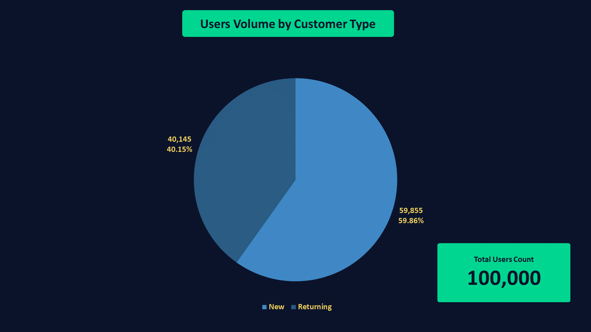
#### **Key Findings**
- **New** customers account for **59.86%** of the total user base.
- **Returning** customers represent **40.15%** of users.
- The dataset contains approximately **20 percentage points** more new customers than returning customers, making new customers the dominant customer segment.
#### **Business Interpretation**
The dataset is primarily composed of users labeled as **New** customers, while **Returning** customers represent a substantial minority of the user base.

At the EDA stage, these values should be interpreted as customer classifications available in the dataset rather than validated behavioral patterns. Subsequent analyses should verify whether these labels are reflected in actual customer behavior, such as cart creation frequency, purchase completion, and cart abandonment rates.
### **Users Volume Trend**
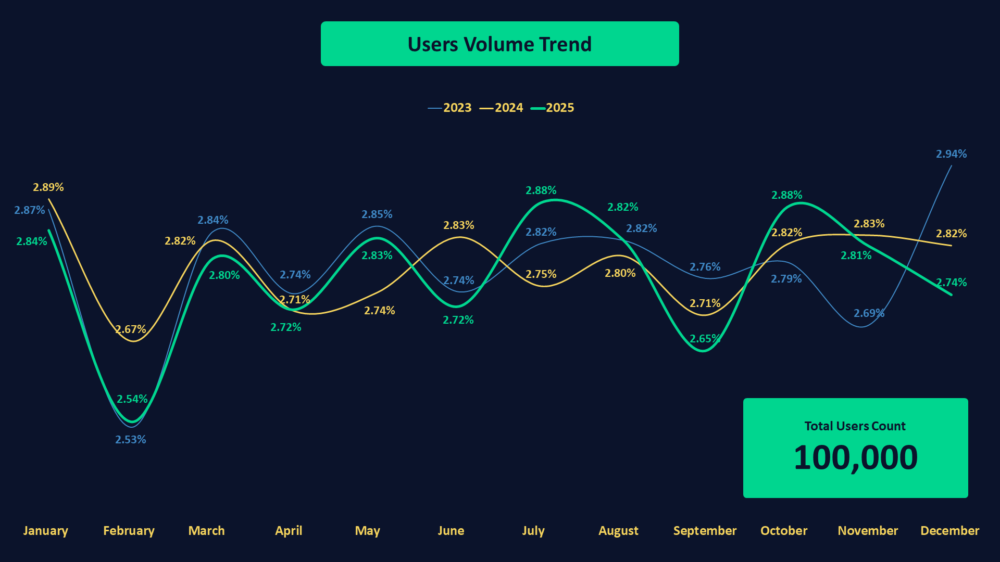
#### **Key Findings**
- User registrations remain remarkably stable throughout the three-year period, with no significant fluctuations in monthly registrations.
- Monthly registrations range from **2.53%** to **2.94%** of the total user base, representing a narrow variation of only **0.41 percentage points**.
- The highest number of registrations occurred in **December 2023 (2.94%)**, while the lowest was recorded in **February 2023 (2.53%)**.
- The average monthly share of registrations is **2.78%**, which is very close to the median (**2.81%**), indicating a consistent monthly distribution.
- Trendline analysis shows a **slight upward trend** in user registrations over the three-year period. However, the calculated slope is very small, suggesting that the increase is gradual and overall registration volumes remain relatively stable.
#### **Business Interpretation**
User registrations are consistently distributed throughout the observation period, with only minor month-to-month variations. Although the overall trend is slightly positive, the growth rate is modest, indicating that the platform experienced stable customer acquisition rather than periods of rapid expansion or decline.

This stable acquisition pattern provides a reliable baseline for subsequent analyses, allowing changes in cart abandonment or conversion performance to be interpreted with minimal influence from large fluctuations in user registration volume.
### **Users Volume by Age Group**
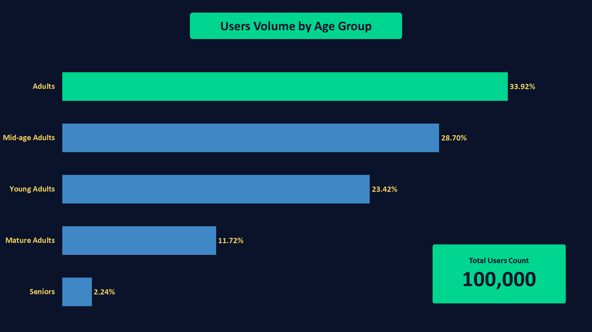
#### **Key Findings**
- **Adults (25–34)** represent the largest age segment, accounting for **33.92%** of the total user base.
- **Mid-age Adults (35–44)** are the second-largest group, contributing **28.70%** of users.
- **Young Adults (18–24)** account for **23.42%** of the customer base.
- **Mature Adults (45–54)** represent **11.72%** of all users.
- **Seniors (55+)** make up the smallest age segment, accounting for only **2.24%** of the total user base.
- Overall, the dataset is concentrated in the **25–44** age range, which represents over **62%** of all users.
#### **Business Interpretation**
The dataset is primarily composed of users between **25 and 44 years old**, indicating that the platform's customer base is concentrated in the core adult age segments. Younger and older users represent smaller proportions of the dataset.

This demographic distribution provides a strong basis for evaluating whether shopping behavior varies across age groups. In the subsequent business analysis, age segments will be compared in terms of cart creation, checkout completion, and cart abandonment rates to determine whether customer age influences purchasing behavior.
### **Users Volume by Premium Status**
#### **Key Findings**
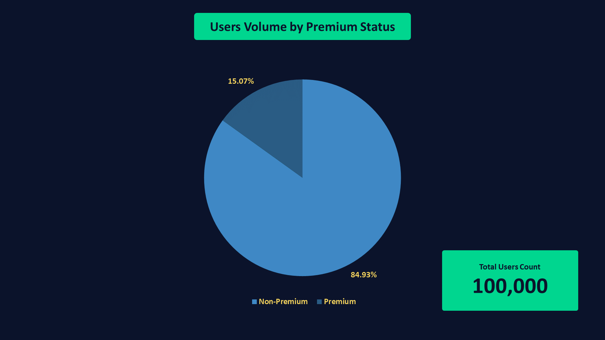
- **Non-Premium** users represent the majority of the customer base, accounting for **84.93%** of all users.
- **Premium** users account for **15.07%** of the total user base.
- The dataset is predominantly composed of standard users, with approximately **one out of every seven users** belonging to the premium segment.
#### **Business Interpretation**
The user base is primarily composed of **non-premium customers**, while premium users represent a smaller but meaningful customer segment. This segmentation provides an opportunity to compare behavioral differences between premium and non-premium users during the business analysis phase.

Subsequent analyses will evaluate whether premium membership is associated with differences in cart creation, checkout completion, purchase behavior, and cart abandonment rates.
### **Products Distribution by Category**
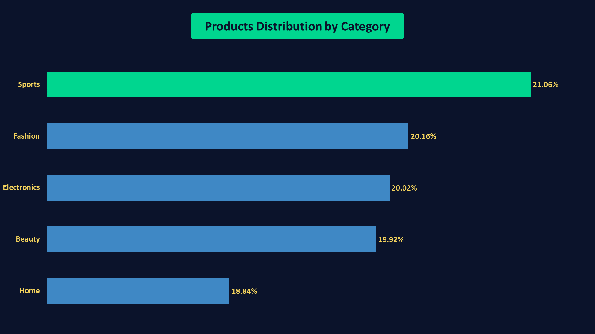
#### **Key Findings**
- **Sports** is the largest product category, accounting for **21.06%** of the total product catalog.
- **Fashion** is the second-largest category, representing **20.16%** of all products.
- **Electronics** and **Beauty** contribute **20.02%** and **19.92%**, respectively.
- **Home** contains the smallest number of products, accounting for **18.84%** of the catalog.
- Product distribution is relatively balanced across all categories, with only a **2.22 percentage point** difference between the largest and smallest category.
#### **Business Interpretation**
The product catalog is **well-balanced** across the **five** major categories, with no single category dominating the inventory. This balanced distribution reduces category-level bias and provides a solid foundation for comparing customer behavior across different product categories.

In the subsequent business analysis, product categories will be evaluated to determine whether cart abandonment, checkout completion, and purchasing behavior differ across categories.
### **Products Distribution by Brand**
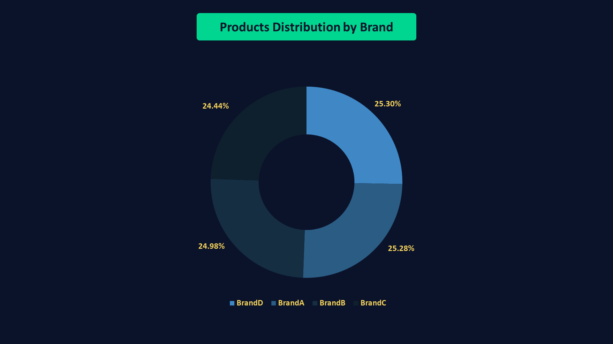
#### **Key Findings**
- **BrandD** has the largest product portfolio, accounting for **25.30%** of the total products.
- **BrandA**, **BrandB**, and **BrandC** contribute **25.28%**, **24.98%**, and **24.44%** of the product catalog, respectively.
- Product distribution across brands is highly balanced, with less than a **1 percentage point** difference between the largest and smallest brand.
- No single brand dominates the product catalog, indicating a well-diversified brand distribution.
#### **Business Interpretation**
The product catalog is evenly distributed across all brands, with each brand contributing approximately one-quarter of the total inventory. This balanced distribution minimizes brand-level bias and provides a reliable foundation for comparing customer behavior across brands.

In the business analysis phase, brand performance can be evaluated using metrics such as cart abandonment rate, conversion rate, and purchase volume to determine whether customer behavior differs by brand rather than by product availability.
### **Products Distribution by Active Status**
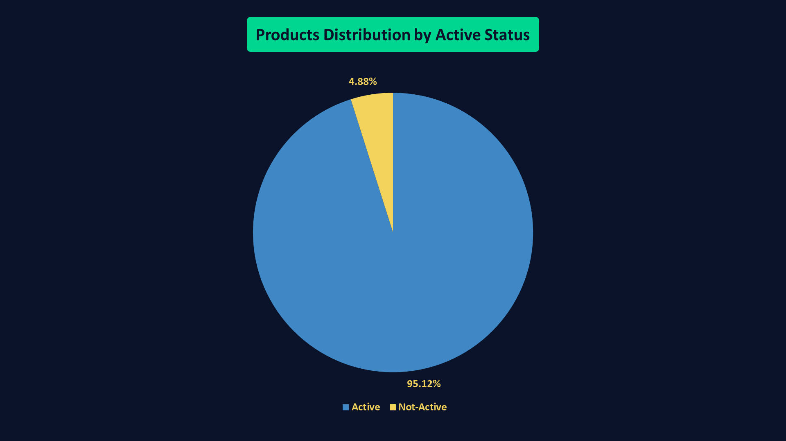
#### **Key Findings**
- **Active** products account for **95.12%** of the total product catalog.
- **Not Active** products represent only **4.88%** of all products.
- The dataset is predominantly composed of active products, indicating that the majority of the product catalog is currently available for customer interaction.
#### **Business Interpretation**
Most products in the dataset are marked as **Active**, while only a small proportion are classified as **Not Active**. This suggests that the product catalog is largely operational and available for customers.

It is important to note that **product activity status should not be interpreted as inventory availability**. A product may remain active even when its stock reaches zero, as demonstrated during the data quality assessment. Therefore, product availability should be evaluated using both the **`is_active`** and **`stock`** attributes rather than relying on either field alone.
### **Price Distribution Analysis**
| Metric         | Value      |
| -------------- | -----------|
| Count          | 5,000      |
| Average        | 624.07     |
| Median         | 559.765    |
| Minimum        | 5.38       |
| Q1             | 283.2525   |
| Q3             | 838.70     |
| IQR            | 555.45     |
| Maximum        | 2902.08    |
| Standard Deviation | 469.18 |
| Upper Bound    | 1671.87    |
| Lower Bound    | -549.91    |
| Upper Outliers | 221 (4.42%)|
#### **Key Findings**
- Product prices range from **5.38** to **2,902.08**, indicating a wide variation in product pricing.
- The **average price (624.07)** is slightly higher than the **median price (559.77)**, suggesting a **slight right-skewed** price distribution driven by a small number of high-priced products.
- The middle **50%** of product prices fall between **283.25 (Q1)** and **838.70 (Q3)**, resulting in an **Interquartile Range (IQR)** of **555.45**.
- Based on the IQR method, the calculated **upper bound** is **1,671.87**, with **221 products (4.42%)** identified as high-price outliers.
- No lower-price outliers were detected, as the calculated lower bound (**-549.91**) falls below the minimum observed product price.
#### **Business Interpretation**
The product catalog is primarily composed of products within the **low-to-mid** price range, while a relatively small proportion of **premium-priced** products extend the upper end of the distribution. This results in a slight positive (**right**) skew, which is commonly observed in e-commerce product catalogs.

The presence of a limited number of **high-priced** products increases the average price without substantially affecting the median, making the **median** a more representative measure of the typical product price. These pricing characteristics provide useful context for subsequent analyses, such as evaluating whether product price influences cart abandonment behavior or purchase completion.
### **Products Distribution by Price Bucket**
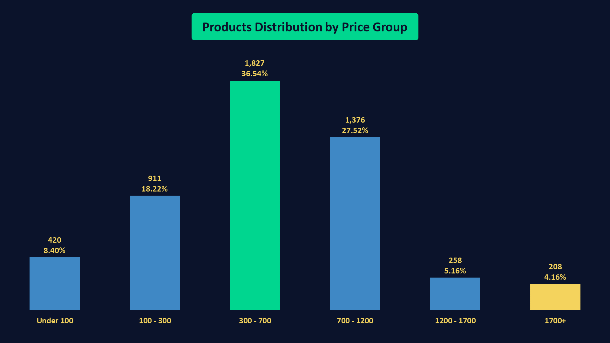
#### **Key Findings**
- The **300–700** price range contains the largest share of products, accounting for **36.54%** of the product catalog.
- The **700–1200** price range is the second largest, representing **27.52%** of all products.
- Together, products priced between **300 and 1200** account for **64.06%** of the entire catalog, indicating that most products are concentrated within the mid-price range.
- Only **4.16%** of products are priced above **1700**, making premium-priced products a relatively small segment of the catalog.
#### **Business Interpretation**
The product catalog is heavily concentrated in the **mid-price** range, with nearly two-thirds of all products priced between **300** and **1200**. This suggests that the business primarily targets customers seeking moderately priced products rather than premium offerings.

The relatively small proportion of products priced above **1700** is consistent with the previous statistical analysis, which identified a limited number of high-price outliers using the IQR method. Together, both analyses indicate that while premium-priced products exist, they represent only a small fraction of the overall catalog and contribute to the slight right-skew observed in the price distribution.
### **Cost Distribution Analysis**
| Metric         | Value      |
| -------------- | -----------|
| Count          | 5,000      |
| Average        | 406.29     |
| Median         | 355.155    |
| Minimum        | 3.22       |
| Q1             | 178.9075   |
| Q3             | 540.4925   |
| IQR            | 361.584    |
| Maximum        | 2069.21    |
| Standard Deviation | 312.71 |
| Upper Bound    | 1082.87    |
| Lower Bound    | -363.469   |
| Upper Outliers | 231 (4.62%)|
#### **Key Findings**
- Product costs range from **3.22** to **2,069.21**, indicating substantial variation in product costs.
- The **average cost (406.29)** is slightly higher than the **median cost (355.16)**, suggesting a **slight right-skewed** cost distribution.
- The middle 50% of product costs fall between **178.91 (Q1)** and **540.49 (Q3)**, resulting in an **Interquartile Range (IQR)** of **361.58**.
- Based on the IQR method, the calculated **upper bound** is **1,082.87**, with **231 products (4.62%)** identified as high-cost outliers.
- No lower-cost outliers were detected since the calculated lower bound (**-363.47**) is below the minimum observed cost.
#### **Business Interpretation**
Most products have relatively low to moderate costs, while a small proportion of products incur substantially higher costs. These high-cost products create a slight positive (right) skew in the cost distribution without affecting the majority of the catalog.

Understanding the cost distribution provides valuable context for subsequent profitability analysis. In the next stage of the EDA, product margins (**Price − Cost**) will be examined to assess how product costs translate into profitability across the catalog.
### **Products Distribution by Cost Groups**
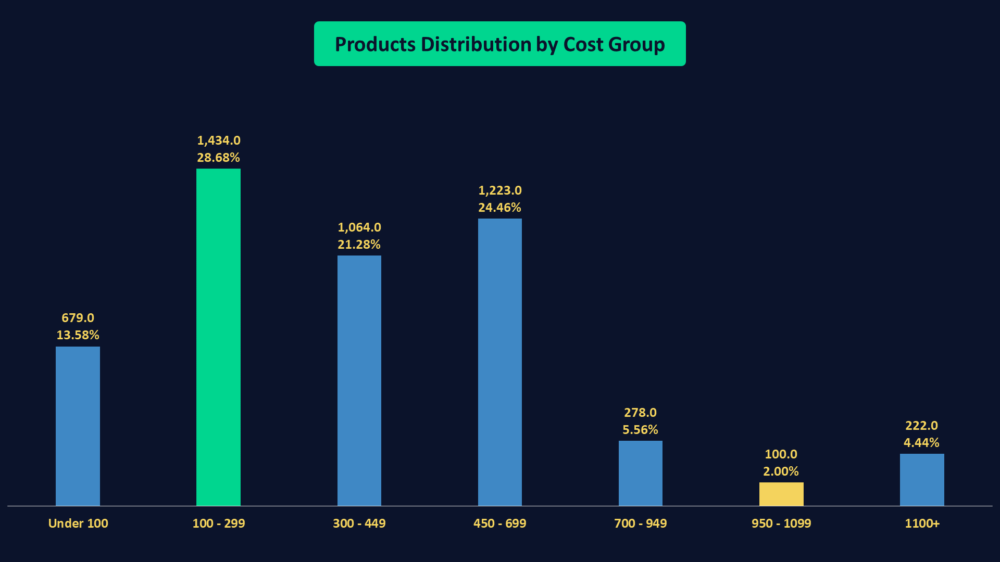
#### **Key Findings**
- The **100–299** cost range contains the largest share of products, accounting for **28.68%** of the product catalog.
- Products with costs between **450–699** and **300–449** account for **24.46%** and **21.28%**, respectively.
- Together, products costing between **100** and **699** represent **74.42%** of the entire catalog, indicating that most products are concentrated within the low-to-mid cost range.
- Only **4.44%** of products have costs exceeding **1,100**, making high-cost products a relatively small segment of the catalog.
- The **950–1099** cost group is the smallest, accounting for only **2.00%** of all products.
#### **Business Interpretation**
The product catalog is primarily composed of products with low to moderate costs, with nearly three-quarters of all products costing between **100** and **699**. This indicates that the majority of inventory is concentrated within the core operating cost range.

The relatively small proportion of products with costs above **1,100** aligns with the previous statistical analysis, where only **4.62%** of products were identified as high-cost outliers using the IQR method. This consistency reinforces that high-cost products represent only a small portion of the overall catalog.
### **Margin Distribution Analysis**
| Metric         | Value      |
| -------------- | -----------|
| Count          | 5,000      |
| Average        | 217.78     |
| Median         | 182.18     |
| Minimum        | 1.46       |
| Q1             | 93.43      |
| Q3             | 288.815    |
| IQR            | 195.385    |
| Maximum        | 1336.34    |
| Standard Deviation | 177.48 |
| Upper Bound    | 581.892    |
| Lower Bound    | -199.647   |
| Upper Outliers | 228 (4.56%)|
#### **Key Findings**
- Product margins range from **1.46** to **1,336.34**, indicating considerable variation in profitability across products.
- The **average margin (217.78)** is slightly higher than the **median margin (182.18)**, suggesting a **slight right-skewed** margin distribution.
- The middle 50% of product margins fall between **93.43 (Q1)** and **288.82 (Q3)**, resulting in an **Interquartile Range (IQR)** of **195.39**.
- Based on the IQR method, the calculated **upper bound** is **581.89**, with **228 products (4.56%)** identified as high-margin outliers.
- No lower-margin outliers were detected, as the calculated lower bound (**-199.65**) is below the minimum observed margin.
#### **Business Interpretation**
Most products generate relatively modest profit margins, while a small proportion of products deliver substantially higher margins. These high-margin products create a slight positive (right) skew in the overall margin distribution without affecting the majority of the catalog.

The margin distribution closely mirrors the previously observed price and cost distributions. This consistency indicates that products with exceptionally high selling prices also tend to have higher costs and margins, suggesting that the pricing structure remains relatively balanced across the product catalog.
### **Margin Distribution by Cost Groups**
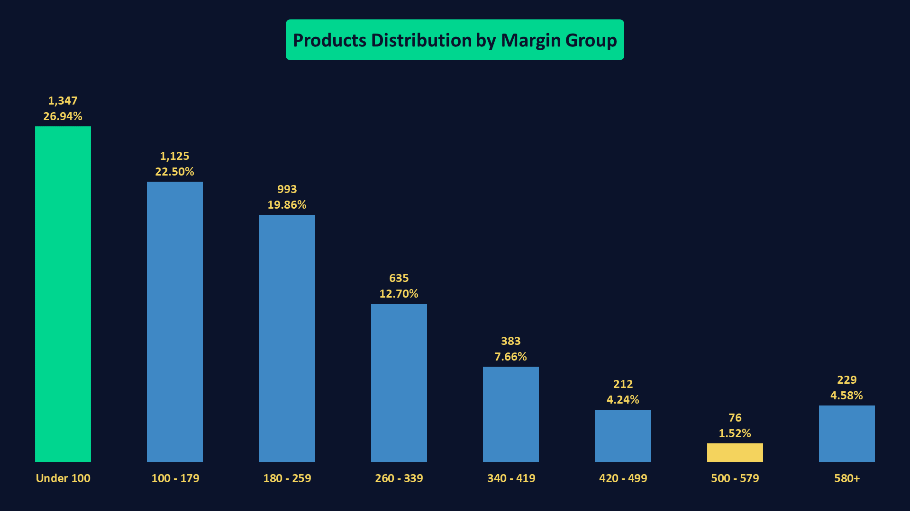
#### **Key Findings**
- The **Under 100** margin group contains the largest share of products, accounting for **26.94%** of the product catalog.
- Products with margins between **100–179** and **180–259** represent **22.50%** and **19.86%**, respectively.
- Together, products with margins below **260** account for **69.30%** of the entire catalog, indicating that most products generate relatively modest profit margins.
- Products with margins above **580** represent only **4.58%** of the catalog, closely matching the percentage of high-margin outliers identified in the statistical analysis.
- The **500–579** margin group is the smallest, accounting for just **1.52%** of all products.
#### **Business Interpretation**
The majority of products generate relatively low to moderate profit margins, with nearly **70%** of the catalog producing margins below **260**. This indicates that the business primarily relies on a large volume of products with modest profitability rather than a small number of highly profitable items.

Only a small proportion of products (**4.58%**) generate margins above **580**, which aligns closely with the outlier analysis performed using the IQR method. These high-margin products represent a premium segment of the catalog and may warrant further investigation to understand whether they also contribute disproportionately to revenue, conversion rates, or overall profitability.
### **Rating Distribution Analysis**
| Metric         | Value      |
| -------------- | -----------|
| Minimum        | 2.5        |
| Average        | 3.75       |
| Median         | 3.70       |
| Maximum        | 5          |
| Standard Deviation | 0.72   |
#### **Key Findings**
- Product ratings range from **2.5** to **5.0**, indicating that all products have relatively positive customer ratings.
- The **average rating (3.75)** is very close to the **median rating (3.70)**, suggesting a nearly symmetric distribution with a slight right skew.
- The **standard deviation (0.72)** indicates relatively low variability, meaning that most product ratings are clustered around the average.
#### **Business Interpretation**
Overall, product ratings are consistently high across the catalog, with limited variation between products. This suggests that the dataset does not contain substantial differences in customer satisfaction at the EDA stage. Any relationship between product ratings and cart abandonment or purchase behavior should therefore be investigated during the business analysis rather than inferred from the distribution alone.

